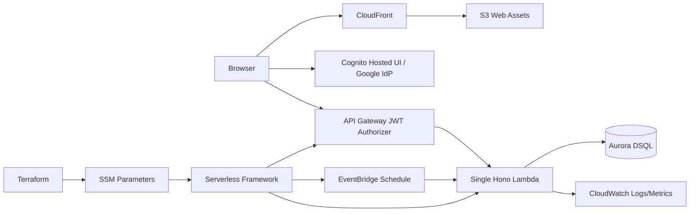
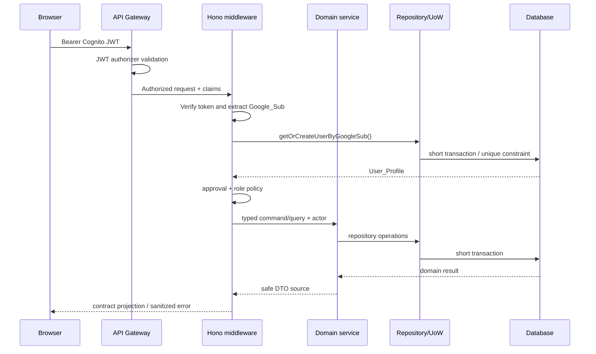
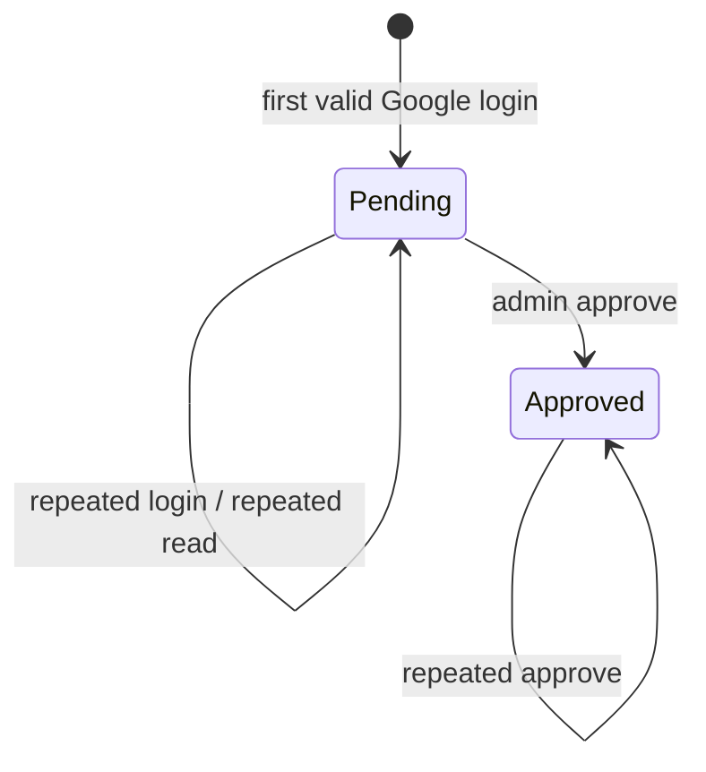
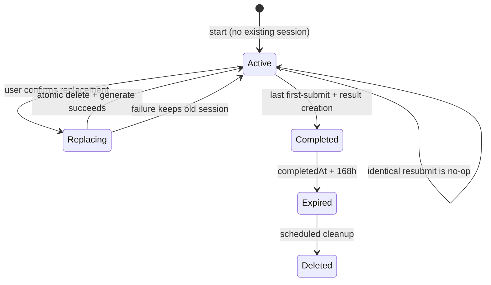
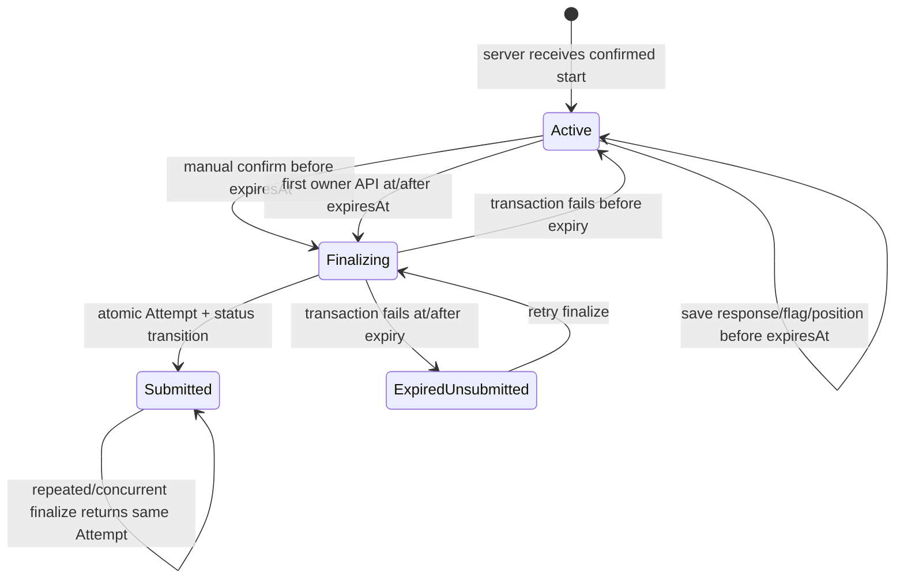
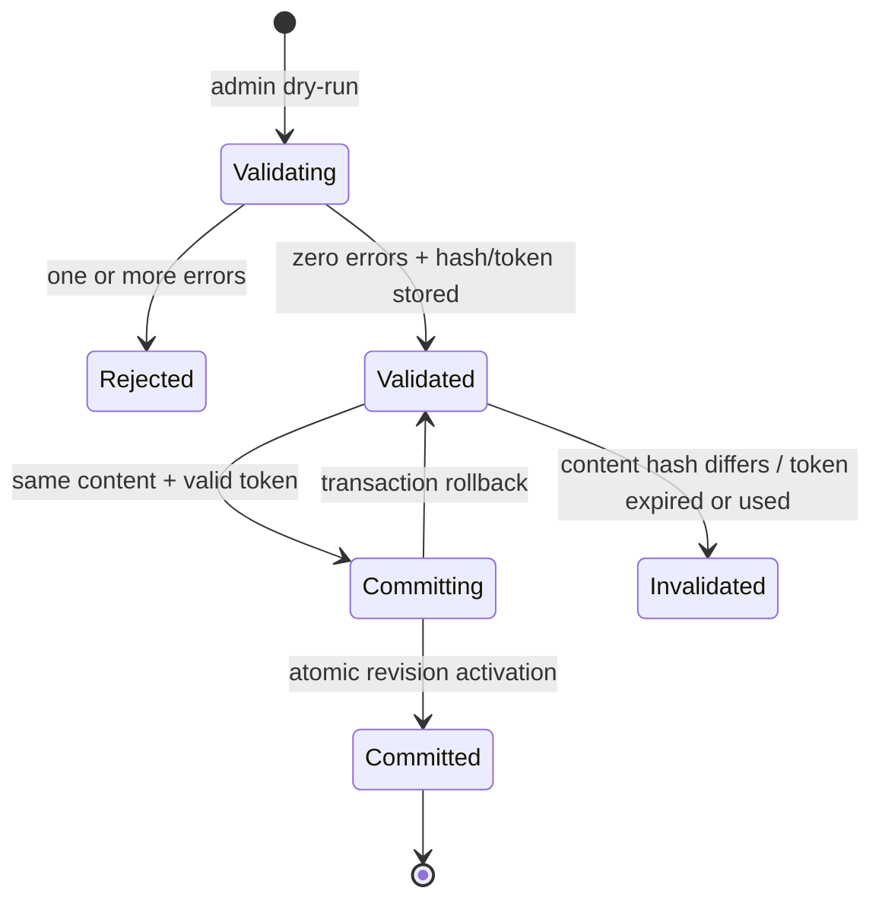
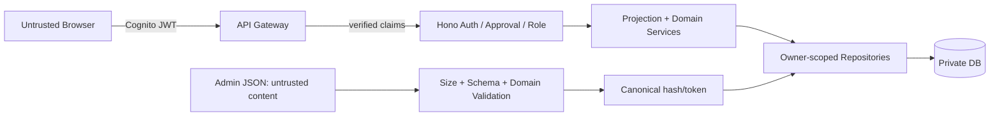
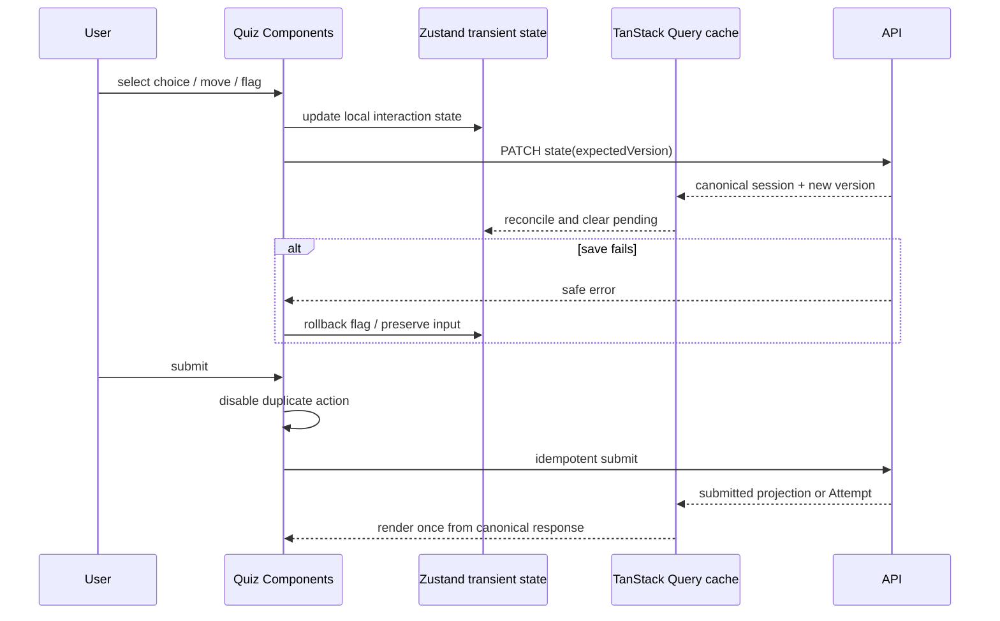
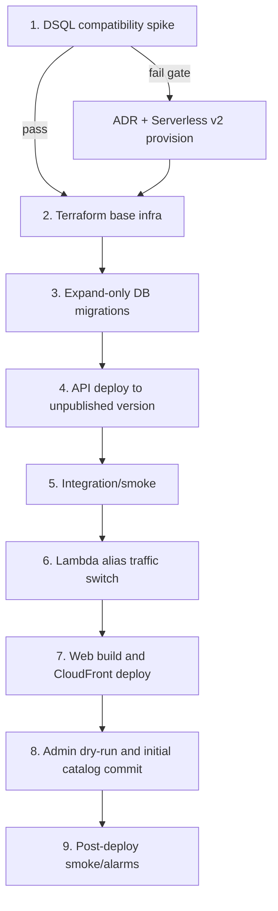

# CertQuiz MVP 설계 문서

## Overview

CertQuiz MVP는 승인된 소수 사용자가 클라우드 자격증 문제를 연습 또는 모의고사 모드로 풀고, 모의고사 이력과 공개 리더보드를 확인하는 비공개 웹 애플리케이션이다. 이 설계는 `.kiro/specs/cert-quiz-mvp/requirements.md`를 유일한 규범적 제품 요구사항으로 사용한다. 루트의 `design.md`와 `wireframes.html`은 배경과 화면 흐름 참고 자료이며, 충돌할 경우 스펙 요구사항이 우선한다.

첫 릴리스의 실제 콘텐츠는 AWS DOP-C02 하나지만, Provider → Certification → Domain → Question 계층과 자격증별 채점 설정을 데이터로 관리한다. 신규 자격증은 애플리케이션 분기 추가가 아니라 검증된 JSON 임포트로 제공한다.

### Goals

- Cognito Google SSO와 앱 DB의 `pending`/`approved` 상태를 결합해 인증과 승인을 분리한다.
- 연습과 모의고사에 동일한 largest-remainder 도메인 배정 및 균등 무작위 추출을 적용한다.
- 정답·해설 공개 시점을 서버 응답 projection으로 강제해 클라이언트 우회에 의한 정답 유출을 막는다.
- 서버 `expires_at`과 lazy idempotent finalize로 모의고사 제한 시간 및 동시 제출을 일관되게 처리한다.
- 세션과 결과에 불변 스냅샷을 저장해 문제 은행 교체 후에도 사용자가 본 내용을 보존한다.
- 원점수, 정답률, 참고 1000점 환산값을 분리하고 반올림 전 정답률을 판정과 순위에 사용한다.
- JSON dry-run의 내용 해시와 일회성 토큰을 atomic commit에 결합해 검증된 데이터만 교체한다.
- Aurora DSQL 의존성을 repository abstraction 뒤에 두고 초기 호환성 spike를 통과하지 못하면 Aurora Serverless v2 PostgreSQL로 전환한다.

### Non-goals

요구사항의 Out of Scope를 따른다. 특히 모바일 최적화, 다크 모드, 관리자 Question 웹 CRUD, 이메일 알림, 고급 사용자 관리, 공식 AWS 1000점 환산 모사, 연습 결과 장기 보관은 포함하지 않는다.

### Key design decisions

| 결정 | 선택 | 근거 |
|---|---|---|
| 저장소 | pnpm workspace 기반 TypeScript 모노레포 | API 계약과 도메인 타입을 공유하되 배포 단위는 분리 |
| 웹 | React, Vite, React Router, TanStack Query, Zustand, Tailwind CSS, shadcn/ui | 서버 상태와 로컬 풀이 UI 상태의 책임 분리 |
| API | API Gateway + Hono 단일 Node.js Lambda | 작은 트래픽에서 운영 비용과 배포 복잡도 최소화 |
| DB | 우선 Aurora DSQL, 조건부 Aurora Serverless v2 PostgreSQL | scale-to-zero 지향과 PostgreSQL 생태계 사이의 검증 가능한 선택 |
| ID | 애플리케이션 생성 UUID | DB vendor별 sequence/identity 차이 제거, 동시 생성 안전성 확보 |
| 시간 | 서버 UTC `timestamptz`, `Clock` 주입 | 만료·보관 경계 테스트와 클라이언트 시계 조작 방지 |
| 무작위성 | 암호학적 RNG adapter 주입, 도메인 로직은 RNG 인터페이스만 의존 | 운영 균등성 및 결정적 테스트 동시 확보 |
| 임포트 | 정규화·검증 → SHA-256 해시 + opaque token → atomic active revision 전환 | dry-run과 commit 사이 TOCTOU 차단 |
| 결과 보존 | 세션/Attempt/완료 연습 결과의 비정규화 불변 스냅샷 | 원본 카탈로그 교체와 과거 결과 분리 |

### Research summary and decision impact

- Aurora DSQL은 PostgreSQL 호환 분산 SQL 서비스지만 연결 시 일반 비밀번호 대신 IAM 기반 단기 인증 토큰을 요구한다. Node.js에서는 AWS의 node-postgres connector가 토큰 생성·갱신과 pooling을 지원하므로 DB adapter의 1순위 연결 방식으로 사용한다. [AWS Aurora DSQL Connector for node-postgres](https://docs.aws.amazon.com/aurora-dsql/latest/userguide/SECTION_program-with-dsql-connector-for-node-postgres.html)
- 인증 토큰은 연결 수립에 사용되고 연결은 TLS로 보호된다. Lambda에는 정적 DB 비밀번호를 두지 않고 실행 역할에 최소 DSQL 연결 권한만 부여한다. [Accessing Aurora DSQL with PostgreSQL-compatible clients](https://docs.aws.amazon.com/aurora-dsql/latest/userguide/accessing.html)
- DSQL 연결 세션과 트랜잭션에는 시간 제한이 있으므로 요청 단위의 짧은 트랜잭션만 사용하고, JSON 파싱·검증·해시는 트랜잭션 밖에서 수행한 뒤 active revision 전환만 짧게 처리한다. [Understanding connections in Aurora DSQL](https://docs.aws.amazon.com/aurora-dsql/latest/userguide/working-with-connections.html)
- DSQL의 PostgreSQL 호환 범위가 계속 발전할 수 있으므로 SQL 기능을 추정으로 확정하지 않는다. 실제 dev DSQL에서 migration, 제약, transaction/locking, query plan을 검증하는 spike를 구현 착수의 선행 결정 게이트로 둔다.

위 외부 자료의 내용은 라이선스 준수를 위해 재서술했다.

## Architecture

### System context



브라우저는 Cognito Hosted UI를 통해 Google 로그인하고 Cognito 토큰을 API에 보낸다. API Gateway JWT authorizer가 1차 검증하고, Hono 인증 middleware가 issuer, audience/client, signature, expiry, token use를 다시 검증한 뒤 Google provider subject를 추출한다. 앱 DB의 User_Profile을 조회하거나 최초 로그인 시 원자적으로 `pending`으로 생성한다. approval middleware는 pending 사용자를 승인 상태 조회 이외의 보호 route에서 차단한다.

### Monorepo and dependency direction

```text
/
├─ apps/
│  ├─ web/                 # React SPA
│  └─ api/                 # Hono composition root, routes, middleware, Lambda handlers
├─ packages/
│  ├─ contracts/           # API DTO, discriminated response projections, schemas
│  ├─ domain/              # 순수 도메인 로직, 상태 전이, ports
│  └─ db/                  # SQL repositories, DSQL/PG connection adapters, migrations
├─ infra/
│  ├─ terraform/           # 기반 인프라
│  └─ serverless/          # Lambda/API Gateway/schedule 배포
└─ tests/
   └─ e2e/                 # 브라우저/API end-to-end
```

의존 방향은 `apps/* → packages/contracts|domain|db`, `packages/db → packages/domain`, `packages/contracts → 공유 primitive`이다. `packages/domain`은 React, Hono, AWS SDK, SQL driver를 import하지 않는다. `packages/contracts`는 전송 schema만 소유하고 DB row 타입을 노출하지 않는다. API composition root만 repository, clock, RNG, signer를 구체 구현에 연결한다.

권장 주요 파일은 다음과 같다.

```text
apps/web/src/
  app/router.tsx
  app/query-client.ts
  auth/AuthCallbackPage.tsx
  auth/PendingApprovalPage.tsx
  catalog/HomePage.tsx
  quiz/PracticePage.tsx
  quiz/ExamPage.tsx
  quiz/QuestionPresenter.tsx
  quiz/QuestionNavigator.tsx
  quiz/quiz-store.ts
  results/PracticeResultPage.tsx
  results/ExamResultPage.tsx
  history/HistoryPage.tsx
  leaderboard/LeaderboardPage.tsx
  admin/PendingUsersPage.tsx
  admin/ImportPage.tsx
  components/AsyncBoundary.tsx

apps/api/src/
  lambda.ts
  app.ts
  middleware/authentication.ts
  middleware/approval.ts
  middleware/admin.ts
  middleware/request-context.ts
  routes/me.ts
  routes/catalog.ts
  routes/practice.ts
  routes/exams.ts
  routes/results.ts
  routes/history.ts
  routes/leaderboard.ts
  routes/admin-users.ts
  routes/admin-import.ts
  jobs/practice-retention.ts
  observability/logger.ts

packages/domain/src/
  auth/
  catalog/
  generation/allocate-domains.ts
  generation/sample-without-replacement.ts
  scoring/score-question.ts
  scoring/score-attempt.ts
  practice/practice-service.ts
  exam/exam-service.ts
  exam/finalize-exam.ts
  results/
  leaderboard/
  import/validate-import.ts
  ports/{repositories,clock,rng,hash}.ts

packages/contracts/src/
  common.ts
  auth.ts
  catalog.ts
  question-projections.ts
  practice.ts
  exams.ts
  results.ts
  history.ts
  leaderboard.ts
  admin.ts
  errors.ts

packages/db/
  migrations/0001_initial.sql
  migrations/0002_*.sql
  src/connection/{dsql.ts,postgres.ts}.ts
  src/repositories/*.ts
  src/unit-of-work.ts
  src/migrate.ts
```

### Request processing pipeline



모든 mutation은 인증된 actor의 `userId`를 URL/body가 아니라 middleware context에서 받는다. repository query 자체에도 owner predicate를 포함해 service 계층 실수만으로 다른 사용자의 데이터가 반환되지 않도록 한다.

### Frontend state architecture

- **TanStack Query**: 카탈로그, 세션 서버 상태, 이력, 리더보드, 관리자 목록/검증 결과를 관리한다. mutation 성공 후 서버 응답을 canonical state로 캐시에 반영한다.
- **Zustand**: 현재 문제 index, 열려 있는 제출 확인 dialog, 저장 중인 optimistic flag 같은 페이지 일시 상태만 관리한다. 응답·flag의 영속 source of truth는 서버다.
- **React Router**: public login, pending, approved user, admin route layout을 분리한다. 프론트 route guard는 UX 용도이며 보안 경계는 API middleware다.
- **QuestionPresenter**: `PracticeQuestionProjection | ExamQuestionProjection | ReviewQuestionProjection`의 discriminant에 따라 렌더링하며, `correctChoiceIds`가 없는 타입에서는 정답 UI 코드를 호출할 수 없다.
- **Markdown**: raw HTML을 비활성화하고 allowlist sanitizer를 적용한다. 링크에는 안전한 protocol과 `rel="noopener noreferrer"`를 강제하고, 이미지 실패 시 alt와 실패 상태를 유지한다.

### Infrastructure ownership boundary

| Terraform 소유 | Serverless Framework 소유 |
|---|---|
| S3, CloudFront, Route 53/ACM(사용 시) | 단일 Lambda 코드/버전/alias |
| Cognito User Pool, app client, Google IdP | API Gateway routes와 authorizer 연결 |
| Aurora DSQL 또는 폴백 DB | EventBridge practice cleanup schedule과 Lambda event mapping |
| Lambda 실행 IAM role 및 DSQL/Cognito/SSM 최소 권한 | Lambda 환경변수의 SSM dynamic reference |
| SSM parameter 이름/값, CloudWatch retention·budget 기반 설정 | 애플리케이션 log/metric emission 설정 |

Terraform은 `/<service>/<stage>/dsql-endpoint`, `region`, `cognito-user-pool-id`, `cognito-client-id`, `lambda-role-arn` 등을 SSM에 게시한다. Serverless 설정은 값을 복제하지 않고 stage별 SSM path를 참조한다. 동일 리소스를 두 도구가 함께 소유하지 않는다. 민감하지 않은 ID도 환경별 SSM namespace로 분리하며 비밀키는 저장하지 않는다.

### Aurora DSQL compatibility spike and decision gate

구현의 첫 기술 spike는 실제 `certquiz-dev-*` DSQL cluster와 Lambda와 동일한 Node.js 버전에서 수행한다. 아래 항목을 versioned SQL migration과 실제 repository query로 검증한다.

1. AWS node-postgres connector의 IAM token 자동 갱신, TLS hostname/CA 검증, Lambda freeze/thaw 후 pool 재사용
2. 앱 생성 UUID의 `uuid` 저장, `timestamptz`, `numeric`, JSON/JSONB 후보 타입 및 필요한 index
3. `UNIQUE`와 `CHECK` 제약, 필요한 참조 무결성 구현 가능 범위
4. 동시 `getOrCreateUser`, practice 교체, 수동/만료 finalize, import commit에 필요한 transaction isolation·conditional update·row contention 동작
5. versioned migration table과 DDL의 반복 실행/실패 복구
6. history/leaderboard/cleanup 핵심 query의 문법, pagination, execution plan 및 최대 예상 데이터에서의 latency
7. 짧은 atomic revision switch와 snapshot insert가 DSQL transaction 제한 내 완료되는지

**통과 게이트:** 위 기능이 문서화된 SQL과 repository contract를 우회 없이 만족하고, 동시성 테스트에서 중복 User/Profile, Session, Attempt가 생성되지 않으며, p95 개발 환경 핵심 query가 500ms 이내이고 migration이 재현 가능해야 한다.

**Aurora Serverless v2 폴백 조건:** 필수 제약/transaction semantics를 구현할 수 없거나, migration tool이 비결정적으로 실패하거나, 연결 connector/pooling이 Lambda에서 안정적이지 않거나, 핵심 query가 index를 사용할 수 없거나, 해결에 vendor-specific 보상 로직이 과도하게 필요하면 spike에서 중단하고 Aurora PostgreSQL Serverless v2로 전환한다. 전환 시 `packages/domain`, contracts, API는 바꾸지 않고 `packages/db` connection adapter와 필요 SQL migration만 조정한다. 폴백 결정은 spike 결과, 실패한 gate, 비용 추정과 함께 ADR로 기록한다.

### Core algorithms

#### Largest-remainder domain allocation

각 domain `i`에 대해 `exact_i = totalQuestions × weight_i / 100`, `base_i = floor(exact_i)`, `remainder_i = exact_i - base_i`를 계산한다. `remaining = totalQuestions - Σbase_i`만큼 remainder 내림차순, 동률이면 import `orderIndex` 오름차순으로 각 domain에 1개씩 추가한다. 정수/decimal 오차를 피하기 위해 weight는 import 시 정규화된 basis points 또는 exact decimal representation으로 계산하고 binary floating point 비교에 의존하지 않는다.

#### Uniform selection and shuffle

각 domain pool에서 partial Fisher–Yates로 allocation 수만큼 중복 없이 추출하고, 합친 문제를 full Fisher–Yates로 섞는다. 운영 RNG는 `crypto.randomInt` 기반 rejection sampling adapter를 사용한다. domain 함수는 `RandomSource.nextInt(maxExclusive)`만 받아 seeded fake로 재현 가능한 테스트가 가능하다. modulo bias가 있는 `%` 기반 구현은 사용하지 않는다.

#### Scoring

- `all_or_nothing`: 선택 집합과 정답 집합이 정확히 같으면 1, 아니면 0.
- `partial`: 선택 수가 required count와 같을 때 `|selected ∩ correct| / |correct|`, 아니면 0.
- `rawScore = ΣquestionScore`
- `accuracyRate = rawScore / questionCount × 100` (내부 계산에서 반올림하지 않음)
- `passed = accuracyRate >= passThreshold`
- `reference1000 = floor(accuracyRate × 10 + 0.5)`

DB에는 exact 계산을 위한 정수 numerator/denominator 또는 충분한 precision의 decimal을 저장하고 API 내부 DTO는 decimal string을 사용한다. UI 표시 시에만 raw/accuracy를 소수점 둘째 자리로 반올림한다.

### State transitions

#### User approval



승인 거절·정지·삭제·역할 편집은 MVP 상태 전이에 없다.

#### Practice session



`Replacing`은 영속 상태가 아니라 하나의 transaction 경계다. 완료 시 active session을 완료 상태로 남겨 중복 마지막 제출을 식별한 후 기존 Completed_Practice_Result를 반환한다. 168시간 전에는 소유자만 review할 수 있고 경계 시각부터 조회는 404/expired 의미 오류를 반환하며 cleanup job이 물리 삭제한다.

#### Exam session



DB 상태는 `active | submitted`; `expired`는 `status=active && now>=expires_at`에서 계산한다. 실패 후 만료된 session은 응답 변경이 금지되지만 finalize retry가 가능하다. `attempt.exam_session_id UNIQUE`와 conditional status update가 정확히 한 Attempt를 보장한다.

#### Import validation



## Components and Interfaces

### Domain ports

```ts
export interface Clock {
  now(): Date;
}

export interface RandomSource {
  nextInt(maxExclusive: number): number;
}

export interface UnitOfWork {
  transaction<T>(work: (repos: TransactionRepositories) => Promise<T>): Promise<T>;
}

export interface UserRepository {
  getOrCreatePendingByGoogleSub(input: NewIdentity): Promise<UserProfile>;
  findPending(): Promise<PendingUser[]>;
  approvePending(userId: string): Promise<UserProfile>;
  updateScoreVisibility(userId: string, visible: boolean): Promise<UserProfile>;
}

export interface CatalogRepository {
  listAvailable(): Promise<ProviderCatalog[]>;
  getGenerationSource(certificationId: string): Promise<GenerationSource | null>;
  activateRevision(validationId: string, normalized: NormalizedImport): Promise<void>;
}

export interface PracticeRepository {
  findActiveOwned(userId: string, certificationId: string): Promise<PracticeSession | null>;
  saveState(command: PracticeStateCommand): Promise<PracticeSession>;
  submitFirstAnswer(command: SubmitPracticeAnswer): Promise<PracticeSubmitResult>;
  replaceAtomically(command: ReplacePractice): Promise<PracticeSession>;
  getCompletedOwned(userId: string, resultId: string, now: Date): Promise<CompletedPracticeResult | null>;
  deleteExpired(cutoffInclusive: Date, batchSize: number): Promise<number>;
}

export interface ExamRepository {
  createWithSnapshots(command: CreateExam): Promise<ExamSession>;
  getOwned(userId: string, sessionId: string): Promise<ExamSession | null>;
  saveBeforeExpiry(command: SaveExamState): Promise<ExamSession>;
  finalizeOnce(command: FinalizeExam): Promise<Attempt>;
}

export interface HistoryRepository {
  listAttempts(userId: string, page: CursorPage): Promise<AttemptSummaryPage>;
  getAttemptOwned(userId: string, attemptId: string): Promise<AttemptDetail | null>;
  getTrend(userId: string): Promise<CertificationTrend[]>;
}

export interface LeaderboardRepository {
  getByCertification(certificationId: string, currentUserId: string): Promise<Leaderboard>;
}
```

Repository는 aggregate 단위 메서드를 제공하고 route에서 SQL primitive를 조합하지 않는다. 모든 write aggregate 메서드는 UnitOfWork transaction에서 실행한다. DSQL/PG 구현 모두 같은 contract test suite를 통과해야 한다.

### Authentication and authorization components

- `CognitoTokenVerifier`: 허용 issuer, userPool/client ID, token use, signature, exp를 검증한다. 로그에 raw JWT나 claim 전체를 남기지 않는다.
- `GoogleIdentityExtractor`: Cognito identities claim에서 provider가 Google인 identity의 `userId`를 `Google_Sub`로 정규화한다. 누락/중복/형식 오류 시 profile mutation 전 인증 실패한다.
- `AuthenticationMiddleware`: `(googleSub, email, displayName)`로 profile을 원자적 get-or-create한다. `google_sub UNIQUE` 충돌은 재조회해 같은 profile을 반환한다.
- `ApprovalMiddleware`: pending에게 `GET /v1/me/approval`과 logout에 필요한 정보만 허용한다.
- `AdminMiddleware`: approved + role admin만 `/v1/admin/*`를 허용한다.
- `OwnershipPolicy`: practice/exam/result/attempt repository 호출에 actor user ID를 강제한다.

### Generation and snapshot components

- `DomainAllocator`: pure function으로 allocation을 계산한다.
- `QuestionSampler`: `RandomSource`로 domain별 unbiased subset과 전체 순서를 만든다.
- `SessionFactory`: pool 부족을 allocation 전에 전부 수집해 하나의 오류로 반환한다. 성공 시 선택된 question/choice 순서, bilingual content, answers, explanation, domain 및 certification scoring metadata를 한 transaction에서 immutable snapshot으로 저장한다.
- `SnapshotProjector`: mode와 공개 상태에 따라 아래 계약 중 하나만 만든다.

```ts
type PracticeQuestionProjection =
  | {
      kind: "practice-unsubmitted";
      id: string;
      stem: LocalizedText;
      choices: PublicChoice[];
      requiredChoiceCount: number;
      selectedChoiceIds: string[];
      flagged: boolean;
    }
  | {
      kind: "practice-submitted";
      id: string;
      stem: LocalizedText;
      choices: PublicChoice[];
      requiredChoiceCount: number;
      selectedChoiceIds: string[];
      flagged: boolean;
      correctChoiceIds: string[];
      isCorrect: boolean;
      earnedScore: string;
      explanation: LocalizedMarkdown;
    };

type ExamQuestionProjection = {
  kind: "exam-active";
  id: string;
  stem: LocalizedText;
  choices: PublicChoice[];
  requiredChoiceCount: number;
  selectedChoiceIds: string[];
  flagged: boolean;
  // correctChoiceIds, isCorrect, explanation, earnedScore 필드가 타입과 JSON에 존재하지 않음
};

type ReviewQuestionProjection = {
  kind: "review";
  id: string;
  stem: LocalizedText;
  choices: PublicChoice[];
  selectedChoiceIds: string[];
  correctChoiceIds: string[];
  isCorrect: boolean;
  earnedScore: string;
  explanation: LocalizedMarkdown;
};
```

DB snapshot row를 route에서 직접 serialize하지 않는다. 공개 DTO schema는 `.strict()` 검증을 거쳐 예상치 못한 정답 필드가 들어오면 응답 생성 자체를 실패시킨다.

### Practice service

- `start`: active가 없으면 생성, 있으면 `resume-or-replace-required`와 session summary를 반환한다.
- `resume`: snapshot, choice order, responses, lock state, reveal state, flags, current position을 반환한다.
- `replace`: 사용자 확인 nonce를 요구하고 기존 삭제+신규 snapshot 생성을 원자적으로 수행한다.
- `saveState`: 응답/flag/position 변경을 version 기반 optimistic concurrency(`expectedVersion`)로 저장한다.
- `submitQuestion`: choice ownership와 정확한 선택 수를 검증한다. 최초 성공은 final answer와 score를 잠근다. 같은 집합 재제출은 기존 결과, 다른 집합은 conflict를 반환한다.
- `complete`: 마지막 미제출 answer transaction에서 completed result snapshot을 생성하고 result ID를 session에 기록한다.
- `retentionCleanup`: `expires_at <= now`인 result를 작은 batch로 삭제하며 재실행 가능하다.

### Exam service and lazy finalize

`OwnedExpiredExamFinalizer`는 인증·사용자 식별 직후, approval/role/ownership별 정상 handler 전에 **모든 인증된 API_Request**에서 실행된다. `requestReceivedAt`에 해당 사용자가 소유한 `status=active AND expires_at<=requestReceivedAt` 세션을 `(expires_at ASC, exam_session_id ASC)` 순서로 조회해 원래 명령보다 먼저 각각 `finalizeOnce(reason="expired", scoringCutoff=expiresAt)`를 호출한다. 특정 exam 대상 요청도 같은 정렬 규칙 안에서 처리하며, finalize가 성공한 세션의 Attempt는 유지된다. 순차 처리 중 하나가 실패하면 이후 finalize와 원래 handler를 실행하지 않고, 실패한 소유자 Exam_Session ID만 포함한 재시도 가능 오류를 반환한다. 단순 시간 경과나 background schedule만으로 Attempt를 만들지 않는다.

수동 제출은 API가 받은 시각이 `expiresAt`보다 이른 경우에만 `reason="manual"`이다. transaction 시작이 지연되어 만료되더라도 제출 요청 수신 시각과 저장 완료 시각을 사용한다. 채점 대상 응답은 `saved_at <= scoringCutoff`만 포함한다. 동시 finalize는 unique `attempt.exam_session_id`, session conditional transition, 기존 Attempt 재조회로 같은 식별자와 결과를 반환한다.

### Import service

1. 원본 byte length가 `10 × 1,048,576`을 초과하면 JSON parser를 호출하기 전에 실제 크기와 10 MiB 제한을 포함해 거부한다.
2. JSON syntax를 검사하고, depth 제한 parser/walker로 중첩 깊이 20, 전체 Question 10,000개, Question당 Choice 20개의 상한을 구조 위치와 함께 검증한다.
3. contract schema로 타입/필수 필드를 검증하되 구조상 후속 검사가 불가능한 항목을 제외한 독립 오류를 누적한다.
4. ID, 관계, weights, answers, 영어 필수 필드, bilingual fields, Domain_Allocation별 pool과 전체 pool 크기를 도메인 validator로 검사한다.
5. 누락 한국어 필드에서 Translation_Status를 서버가 계산하고, 전체 Question 수·Domain별 수·Translation_Status별 수·오류 수를 계산한다. 구조 오류로 계산할 수 없는 요약은 가능한 값은 유지하고 해당 항목만 `unavailable`로 표시한다.
6. key order와 무관한 canonical JSON으로 정규화하고 SHA-256 content hash를 계산한다.
7. 성공 시 256-bit opaque commit token을 반환하고 DB에는 token digest, content hash, actor, expiry, summary만 저장한다. 원문 파일은 validation row에 중복 저장하지 않는다.
8. commit 요청은 token과 동일 JSON을 다시 받고 hash를 constant-time 비교한다. token은 admin/validation에 bind하고 15분 TTL 및 single-use 상태를 갖는다.
9. transaction에서 revision 전체를 insert하고 모든 row 수/관계를 재확인한 뒤 `catalog_head.active_revision_id`를 한 번 전환하고 token을 consumed로 표시한다. 실패 시 head와 token 상태를 rollback한다.

### HTTP API contracts

모든 endpoint는 `/v1` prefix, JSON, UTC ISO-8601, UUID를 사용한다. 성공 envelope는 `{ data, meta? }`, 실패 envelope는 `{ error: { code, message, requestId, details? } }`다. validation details에는 위치·관련 식별자·안전한 원인을 포함할 수 있지만 SQL, stack, JWT, 타 사용자 데이터는 포함하지 않는다.

| Method | Path | 권한 | 핵심 응답/동작 |
|---|---|---|---|
| GET | `/me` | approved | profile의 role, approval, score visibility |
| GET | `/me/approval` | authenticated | 본인의 pending/approved 상태만 제공하는 유일한 pending 허용 route |
| PATCH | `/me/score-visibility` | approved | 공개 설정 저장 |
| GET | `/catalog` | approved | 유효·출제 가능한 certification을 provider별 제공 |
| POST | `/certifications/:id/practice/start` | approved | 새 session 또는 resume/replace 선택 요구 |
| POST | `/practice/:id/resume` | owner | 저장 상태와 안전한 practice projections |
| POST | `/practice/:id/replace` | owner | 확인 후 atomic replacement |
| PATCH | `/practice/:id/state` | owner | response/flag/current position 원자 저장 |
| POST | `/practice/:id/questions/:qid/submit` | owner | 최초 잠금 또는 idempotent 기존 결과 |
| GET | `/practice-results/:id` | owner | 168시간 이내 completed review |
| POST | `/certifications/:id/exams` | approved | 필수 `Idempotency-Key`로 확인 요청을 식별하고 server startedAt/expiresAt와 snapshot 생성; replay는 동일 session 반환 |
| GET | `/exams/:id` | owner | active projection/remaining seconds 또는 finalized redirect |
| PATCH | `/exams/:id/state` | owner | 만료 전 response/flag/position 저장 |
| POST | `/exams/:id/submission-preview` | owner | unanswered/flagged count, 정답 없음 |
| POST | `/exams/:id/submit` | owner | idempotent finalize와 Attempt 반환 |
| GET | `/attempts/:id` | owner | immutable result/review |
| GET | `/history` | approved | submittedAt desc, ID asc cursor pagination |
| GET | `/history/trends` | approved | certification별 count와 chronological accuracy |
| GET | `/leaderboards/:certificationId` | approved | 공개 사용자 최고 성과, 공동 순위, current marker |
| GET | `/admin/pending-users` | admin | display name, email, first login time |
| POST | `/admin/users/:id/approve` | admin | idempotent approve |
| POST | `/admin/imports/dry-run` | admin | summary, all errors, hash-bound commit token |
| POST | `/admin/imports/commit` | admin | 같은 JSON+token의 atomic revision activation |

쓰기 endpoint는 `Idempotency-Key`를 선택적으로 받아 request replay를 흡수하되, exam start 확인 요청은 동일 요청을 식별하도록 `Idempotency-Key`를 필수로 요구하고 `(userId, key)`로 생성 결과를 저장한다. practice question submit과 exam finalize는 도메인 고유키만으로도 idempotent하다. state PATCH는 `expectedVersion`을 요구해 여러 탭의 stale write를 `409 stale-version`으로 거부한다.

## Data Models

### Storage conventions

- 모든 ID는 애플리케이션에서 UUID v7(라이브러리 지원이 안정적이지 않으면 UUID v4)을 생성한다. DB-generated serial/sequence를 사용하지 않는다.
- 모든 시각은 UTC `timestamptz`, 기간 경계는 `[completed_at, expires_at)`로 정의한다.
- 점수는 binary float가 아니라 exact decimal 또는 분자/분모로 저장한다.
- snapshot content는 생성 후 update하지 않는다. 상태 변화는 별도 response/state row에 기록한다.
- 실제 FK/CHECK 지원 여부는 DSQL spike에서 확인한다. DB 기능이 부족해도 repository transaction과 startup schema assertion으로 동일 불변식을 지키며, 이 부족 자체가 핵심 무결성에 영향을 주면 폴백 gate를 실패 처리한다.
- 모든 mutable aggregate는 `version bigint`를 가져 optimistic concurrency를 지원한다.

### Identity and access

```text
user_profiles
- id uuid PK
- google_sub text UNIQUE NOT NULL
- display_name text NOT NULL
- email text NOT NULL
- role text NOT NULL CHECK user|admin
- approval_status text NOT NULL CHECK pending|approved
- score_public boolean NOT NULL DEFAULT false
- first_login_at timestamptz NOT NULL
- approved_at timestamptz NULL
- created_at, updated_at timestamptz NOT NULL
- version bigint NOT NULL

indexes: (approval_status, first_login_at, id)
```

`google_sub`만 외부 계정 동일성 키다. email 변경은 계정 병합을 유발하지 않는다. 최초 profile insert는 `google_sub` unique conflict 시 기존 row를 재조회한다.

### Versioned catalog

```text
catalog_revisions
- id uuid PK
- certification_key text NOT NULL
- content_hash char(64) NOT NULL
- imported_by uuid NOT NULL
- imported_at timestamptz NOT NULL
- status text NOT NULL CHECK staging|active|superseded

catalog_heads
- certification_key text PK
- active_revision_id uuid NOT NULL
- updated_at timestamptz NOT NULL
- version bigint NOT NULL

providers
- id uuid PK
- revision_id uuid NOT NULL
- external_key text NOT NULL
- name text NOT NULL
- logo_url text NULL
- UNIQUE(revision_id, external_key)

certifications
- id uuid PK
- revision_id uuid NOT NULL
- provider_id uuid NOT NULL
- external_key text NOT NULL
- code text NOT NULL
- name text NOT NULL
- total_questions integer NOT NULL
- time_limit_minutes integer NOT NULL
- pass_threshold numeric NOT NULL
- scoring_mode text NOT NULL CHECK all_or_nothing|partial
- UNIQUE(revision_id, external_key)

domains
- id uuid PK
- revision_id uuid NOT NULL
- certification_id uuid NOT NULL
- external_key text NOT NULL
- name text NOT NULL
- weight_basis_points integer NOT NULL
- order_index integer NOT NULL
- UNIQUE(revision_id, certification_id, external_key)
- UNIQUE(revision_id, certification_id, order_index)

questions
- id uuid PK
- revision_id uuid NOT NULL
- certification_id uuid NOT NULL
- domain_id uuid NOT NULL
- external_key text NOT NULL
- stem_en text NOT NULL
- stem_ko text NULL
- explanation_en text NOT NULL
- explanation_ko text NULL
- translation_status text NOT NULL CHECK translated|en_only
- required_choice_count integer NOT NULL
- UNIQUE(revision_id, certification_id, external_key)

choices
- id uuid PK
- revision_id uuid NOT NULL
- question_id uuid NOT NULL
- external_key text NOT NULL
- text_en text NOT NULL
- text_ko text NULL
- order_index integer NOT NULL
- is_correct boolean NOT NULL
- UNIQUE(revision_id, question_id, external_key)
- UNIQUE(revision_id, question_id, order_index)
```

카탈로그 query는 반드시 `catalog_heads.active_revision_id`를 경유한다. staging revision은 사용자에게 보이지 않는다. `weight_basis_points` 합은 certification마다 10,000이어야 하며 import 원본 decimal이 basis point보다 정밀할 수 있다면 canonical decimal 정수 scale을 revision에 함께 저장한다.

### Import validation

```text
import_validations
- id uuid PK
- actor_user_id uuid NOT NULL
- certification_key text NOT NULL
- content_hash char(64) NOT NULL
- token_digest char(64) NOT NULL UNIQUE
- status text NOT NULL CHECK validated|consumed|expired
- total_questions integer NOT NULL
- domain_counts_json json/jsonb NOT NULL
- translation_counts_json json/jsonb NOT NULL
- error_count integer NOT NULL
- expires_at timestamptz NOT NULL
- created_at, consumed_at timestamptz NULL
- version bigint NOT NULL
```

오류가 있는 dry-run은 client에 전체 오류를 반환하되 commit token을 만들지 않는다. 운영상 감사에 필요한 summary만 제한 기간 저장하고 업로드 원문, 정답 포함 payload, plaintext token은 로그에 남기지 않는다.

### Session snapshots

공통 snapshot value object:

```ts
interface QuestionSnapshotContent {
  sourceQuestionId: string;
  externalQuestionKey: string;
  domain: { externalKey: string; name: string };
  stem: { en: string; ko: string | null };
  choices: Array<{
    snapshotChoiceId: string;
    sourceChoiceId: string;
    externalKey: string;
    order: number;
    text: { en: string; ko: string | null };
  }>;
  correctSnapshotChoiceIds: string[];
  requiredChoiceCount: number;
  explanation: { en: string; ko: string | null };
  translationStatus: "translated" | "en_only";
}
```

Choice 표시 순서는 snapshot 안의 `order`로 고정한다. source ID는 추적용일 뿐 review 조회에서 원본 table join을 하지 않는다.

```text
practice_sessions
- id uuid PK
- user_id uuid NOT NULL
- certification_id_at_start uuid NOT NULL
- certification_key text NOT NULL
- status text NOT NULL CHECK active|completed
- current_index integer NOT NULL
- result_id uuid NULL
- created_at, updated_at, completed_at timestamptz NULL
- version bigint NOT NULL
- active_slot text NULL
- UNIQUE(user_id, certification_key, active_slot)
```

active row만 `active_slot='active'`, completed는 NULL로 바꾸는 방식 또는 DB가 지원하는 partial unique index로 사용자+자격증당 active 최대 1개를 보장한다. 실제 방식은 spike에서 검증한다.

```text
practice_session_questions
- id uuid PK
- practice_session_id uuid NOT NULL
- display_index integer NOT NULL
- snapshot_content json/jsonb NOT NULL
- selected_choice_ids json/jsonb NOT NULL DEFAULT []
- final_choice_ids json/jsonb NULL
- earned_score numeric NULL
- submitted_at timestamptz NULL
- flagged boolean NOT NULL DEFAULT false
- updated_at timestamptz NOT NULL
- version bigint NOT NULL
- UNIQUE(practice_session_id, display_index)
- UNIQUE(practice_session_id, id)

completed_practice_results
- id uuid PK
- source_practice_session_id uuid UNIQUE NOT NULL
- user_id uuid NOT NULL
- certification_snapshot json/jsonb NOT NULL
- raw_score numeric NOT NULL
- accuracy_rate numeric NOT NULL
- domain_performance json/jsonb NOT NULL
- completed_at timestamptz NOT NULL
- expires_at timestamptz NOT NULL

completed_practice_items
- id uuid PK
- result_id uuid NOT NULL
- display_index integer NOT NULL
- snapshot_content json/jsonb NOT NULL
- selected_choice_ids json/jsonb NOT NULL
- earned_score numeric NOT NULL
- UNIQUE(result_id, display_index)

indexes: completed_practice_results(user_id, expires_at), (expires_at, id)
```

`expires_at = completed_at + 168 hours`. cleanup은 `(expires_at, id)` cursor로 batch delete한다.

### Exam and Attempt

```text
exam_sessions
- id uuid PK
- user_id uuid NOT NULL
- certification_id_at_start uuid NOT NULL
- certification_key text NOT NULL
- certification_snapshot json/jsonb NOT NULL
- start_request_key text NOT NULL
- status text NOT NULL CHECK active|submitted
- current_index integer NOT NULL
- started_at timestamptz NOT NULL
- expires_at timestamptz NOT NULL
- submitted_at timestamptz NULL
- attempt_id uuid NULL
- version bigint NOT NULL
- UNIQUE(user_id, start_request_key)

exam_session_questions
- id uuid PK
- exam_session_id uuid NOT NULL
- display_index integer NOT NULL
- snapshot_content json/jsonb NOT NULL
- selected_choice_ids json/jsonb NOT NULL DEFAULT []
- flagged boolean NOT NULL DEFAULT false
- saved_at timestamptz NOT NULL
- version bigint NOT NULL
- UNIQUE(exam_session_id, display_index)

attempts
- id uuid PK
- exam_session_id uuid UNIQUE NOT NULL
- user_id uuid NOT NULL
- certification_key text NOT NULL
- certification_snapshot json/jsonb NOT NULL
- raw_score numeric NOT NULL
- accuracy_rate numeric NOT NULL
- reference_1000 integer NOT NULL
- pass_threshold numeric NOT NULL
- passed boolean NOT NULL
- domain_performance json/jsonb NOT NULL
- started_at timestamptz NOT NULL
- expires_at timestamptz NOT NULL
- submitted_at timestamptz NOT NULL
- submission_reason text NOT NULL CHECK manual|expired

attempt_items
- id uuid PK
- attempt_id uuid NOT NULL
- display_index integer NOT NULL
- snapshot_content json/jsonb NOT NULL
- selected_choice_ids json/jsonb NOT NULL
- earned_score numeric NOT NULL
- UNIQUE(attempt_id, display_index)

indexes:
- attempts(user_id, submitted_at DESC, id ASC)
- attempts(certification_key, user_id, accuracy_rate DESC, submitted_at ASC, id ASC)
```

Attempt insert와 exam `status=submitted, attempt_id=...` 전환은 한 transaction이다. Attempt와 item은 update API가 없다.

### Leaderboard query model

후보는 `score_public=true`, `approval_status=approved`, 해당 certification Attempt 보유 사용자다. 각 `(user, certification)` partition에서 `accuracy_rate DESC, submitted_at ASC, attempt_id ASC` 첫 row를 대표 성과로 선택한다. 전체는 `accuracy_rate DESC`로 정렬하며 순위는 동률 accuracy에 같은 값을 주는 standard competition ranking(`1, 2, 2, 4`)을 사용한다. DB window function 지원은 spike에서 확인하고, 미지원이면서 작은 규모라면 repository가 bounded result를 읽어 순수 domain ranker로 계산한다. 계산 기준은 표시용 반올림 값이 아닌 저장된 exact accuracy다.

### Data integrity invariants

1. Google_Sub당 User_Profile은 최대 하나이며 신규 profile은 pending/private이다.
2. 사용자+자격증당 active Practice_Session은 최대 하나다.
3. Session 생성 실패 시 session과 snapshot row는 모두 없다.
4. snapshot의 문제·choice·정답·해설은 생성 후 변경되지 않는다.
5. practice question은 최초 final answer 이후 변경되지 않고 completed result는 session당 하나다.
6. exam session당 Attempt는 최대 하나이며 finalize replay는 같은 Attempt를 반환한다.
7. 만료 이후 저장된 exam state는 채점에 포함하지 않는다.
8. active catalog head는 완전히 검증·삽입된 revision만 가리킨다.
9. dry-run content hash와 commit content hash가 같고 token이 유효할 때만 head를 전환한다.
10. Completed_Practice_Result는 만료 경계부터 사용자 조회 및 모든 통계/리더보드에서 제외된다.
11. 사용자 소유 데이터 query는 항상 actor user ID predicate를 포함한다.
12. active exam/practice projection에는 공개 조건 전 정답과 해설 필드가 존재하지 않는다.


### 구현 정합성 확정 사항

이 절은 앞 절에서 선택지로 남겨 둔 표현을 구현 결정으로 좁힌다. 충돌할 경우 이 절의 구체 결정과 `requirements.md`가 우선한다.

1. **정확 점수 표현:** 도메인 계층은 점수를 `Fraction { numerator: bigint; denominator: bigint }` 기약분수로 계산한다. Question 점수, Raw_Score, Accuracy_Rate를 서로 변환할 때 반올림하지 않는다. 저장소는 각 exact 값의 분자·분모를 정수 열로 저장하고 API는 canonical decimal string과 필요 시 fraction을 내부 DTO로 전달한다. `numeric` 단일 열은 검색 편의를 위한 파생값으로도 판정·순위의 source of truth가 될 수 없다. Pass_Threshold도 import decimal 문자열을 exact fraction으로 정규화한다. 서로 다른 분모의 비교는 cross multiplication으로 수행한다.
2. **표시 반올림:** Raw_Score와 Accuracy_Rate의 소수 둘째 자리 표시는 exact fraction에 decimal half-up을 한 번 적용한다. 합격, 대표 Attempt, 순위, 동률 판정에는 표시 문자열을 사용하지 않는다. Reference_1000_Score만 요구사항의 `floor(Accuracy_Rate × 10 + 0.5)`를 exact fraction에 적용한다.
3. **lazy expiration 범위:** 인증·사용자 식별 직후, 승인/역할별 정상 handler 전에 실행되는 `OwnedExpiredExamFinalizer`가 **모든 인증된 소유자 API_Request**에서 해당 사용자의 `status=active AND expires_at<=requestReceivedAt` 세션을 조회해 먼저 finalize한다. 대상 기능과 관계없이 사용자의 만료 세션을 결정적 순서 `(expires_at, id)`로 모두 처리한다. 하나라도 finalize에 실패하면 실패 전에 commit된 Attempt는 유지하고 이후 finalize와 원 요청은 실행하지 않으며, 실패한 소유자 Exam_Session 식별자만 포함한 재시도 가능한 제출 오류를 반환한다. 단순 시간 경과나 background schedule만으로 Attempt를 만들지 않는다.
4. **168시간 보관:** Completed_Practice_Result의 논리적 가시성은 정확히 `[completed_at, completed_at+168h)`다. 경계 이후 조회 요청은 같은 request에서 조건부 삭제를 먼저 시도하고 항상 만료 응답을 반환한다. EventBridge cleanup은 요청이 없던 결과를 `expires_at<=now` 조건으로 삭제한다. cleanup 지연이 경계 이후 조회 가능성을 연장하지 않는다.
5. **리더보드 동률:** 대표 Attempt는 `accuracy exact DESC, submitted_at ASC, attempt_id ASC`로 선택한다. 사용자 간 순위는 exact Accuracy_Rate만으로 standard competition rank `1 + 자신보다 높은 후보 수`를 계산한다. 같은 exact accuracy의 출력 순서는 결정성을 위해 `representative.submitted_at ASC, user_id ASC`를 사용하되 순위에는 영향을 주지 않는다.
6. **임포트 동일성:** RFC 8785 방식의 JSON canonicalization 원칙(UTF-8, object key 정렬, 배열 순서 보존, 동등한 JSON number의 canonical 표기)에 맞춘 canonical bytes의 SHA-256으로 동일성을 판정한다. Domain 배열 순서는 allocation tie-break이므로 보존한다. 구조 오류 때문에 의존 검사를 수행할 수 없는 경우를 제외하고 독립적으로 검출 가능한 모든 오류를 누적한다.

Exact score 저장의 논리 열은 다음과 같다. 초기 migration에서는 앞 절의 `earned_score`, `raw_score`, `accuracy_rate`, `pass_threshold` 논리 필드를 아래 exact pair로 구현한다.

```text
score_fraction            := (score_numerator bigint, score_denominator bigint > 0)
threshold_fraction        := (threshold_numerator bigint, threshold_denominator bigint > 0)
practice/attempt item     := earned_numerator, earned_denominator
completed result/attempt  := raw_numerator, raw_denominator,
                             accuracy_numerator, accuracy_denominator
certification/attempt     := threshold_numerator, threshold_denominator
```

분자는 0 이상이며 저장 전 최대공약수로 약분한다. DSQL의 정수 범위가 최대 입력에서 안전하지 않으면 canonical decimal을 충분한 고정 scale로 저장하는 우회가 아니라 Serverless v2 폴백 gate를 검토한다. 요구사항의 exact semantics를 DB 제약 때문에 낮추지 않는다.

## Correctness Properties

*A property is a characteristic or behavior that should hold true across all valid executions of a system-essentially, a formal statement about what the system should do. Properties serve as the bridge between human-readable specifications and machine-verifiable correctness guarantees.*

이 기능은 배정, 무작위 추출, 채점, 순위, 상태 전이, 임포트 정규화처럼 입력 공간이 넓은 순수 로직을 포함하므로 property-based testing(PBT)이 적합하다. 반면 React 렌더링, Cognito/AWS 연결, 실제 transaction 지원은 snapshot/example/integration test로 검증한다. Acceptance criteria 사전 분류 후 전체 속성을 반영해 중복을 제거했다. 예를 들어 9.5~9.7은 하나의 168시간 만료 경계 속성으로, 9.8~9.11은 Attempt-only 분석 격리 속성으로, 12.1/12.2는 집합 동등성 속성으로, 11.6~11.10은 하나의 concurrent finalize 상태 머신 속성으로 통합했다.

### Property 1: 외부 신원과 신규 프로필 불변식

*For any* 유효한 Google_Sub와 동일 Google_Sub를 사용한 임의 횟수의 동시 로그인에 대해 User_Profile은 최대 하나이며, 최초 생성된 프로필은 `pending`, `user`, `score_public=false`이고 이메일 변경은 다른 프로필을 생성하거나 계정을 병합하지 않는다. 생성 transaction의 임의 실패에서는 프로필과 관련 보호 데이터가 모두 생성 전 상태를 유지한다.

**Validates: Requirements 1.4, 1.5, 1.6, 1.13, 1.14, 14.1**

### Property 2: 인증·인가 실패의 비간섭성과 역할 경계

*For any* 로그인 결과와 보호 요청에 대해 서명·issuer·audience·expiry·Google_Sub를 모두 통과한 경우에만 사용자를 식별한다. pending 사용자는 본인 승인 상태 조회만 허용되고, approved admin은 관리자 기능을 사용할 수 있지만 일반 사용자는 사용할 수 없으며, 타 사용자 소유 요청을 포함한 모든 거부 요청에서 보호 aggregate의 전후 상태는 동일하고 오류 projection에는 토큰·프로필·보호 데이터가 없다.

**Validates: Requirements 1.1, 1.2, 1.3, 1.7, 1.8, 1.11, 1.12, 2.1, 2.2, 2.3, 2.4**

### Property 3: 승인 전이와 pending 목록의 결정성

*For any* User_Profile 집합에 대해 pending 목록은 각 pending 사용자를 정확히 한 번 포함하고 표시 이름·이메일·최초 로그인 시각만 제공하며, 대상이 없으면 빈 목록이다. `pending`에서의 최초 승인만 상태를 `approved`로 원자적으로 바꾸고, 이후 승인 replay는 같은 상태의 no-op이며, 승인 transaction 실패에서는 모든 상태가 요청 전과 동일하다.

**Validates: Requirements 1.9, 1.10, 1.15, 2.5, 2.6**

### Property 4: 카탈로그 관계 폐쇄성과 노출 안전성

*For any* import revision에 대해 사용자에게 노출되는 모든 Certification은 정확히 하나의 Provider, 유효한 필수 설정, 합 100%인 양수 Domain_Weight, 각 Domain에 속하는 충분한 Question_Pool을 가지며, 생성 대상 Question은 선택 Certification의 관계 폐쇄 안에만 존재한다. 하나라도 위반한 Certification은 목록에서 제외되고 오류에는 유효하지 않은 식별자·원인 또는 부족한 모든 Domain의 이름·보유 수·필요 수가 포함된다.

**Validates: Requirements 3.1, 3.2, 3.3, 3.4, 3.5, 3.6, 3.7, 3.8, 3.10, 3.11**

### Property 5: largest-remainder 배정 정확성

*For any* 양의 회차 문항 수와 합이 100%인 양수 Domain_Weight 목록에 대해 각 배정은 floor 값 또는 floor+1이고, 합은 회차 문항 수이며, +1을 받은 Domain 집합은 `(소수 부분 DESC, import order ASC)`의 앞쪽 Domain과 정확히 일치한다. practice와 exam은 같은 입력에서 같은 배정 규칙을 사용한다.

**Validates: Requirements 4.1, 4.2, 4.3, 4.4, 4.8**

### Property 6: 중복 없는 균등 추출과 순열

*For any* 충분한 Domain pool과 allocation에 대해 선택 결과는 Domain별 정확한 개수의 서로 다른 Question을 포함한다. 작은 유한 pool에서 균등한 모든 RNG outcome을 전수 열거하면 각 동일 크기 부분집합과 각 전체 표시 순서의 발생 횟수는 각각 동일하다.

**Validates: Requirements 4.5, 4.6, 4.7**

### Property 7: 회차 생성의 all-or-nothing과 snapshot 불변성

*For any* 생성 요청에 대해 하나 이상의 pool이 부족하거나 배정·선택·순열·저장이 실패하면 부족한 모든 Domain 정보가 반환되고 session 및 snapshot 수는 전과 같다. 성공하면 session과 모든 Question/Choice 순서 snapshot이 함께 존재하며 이후 원본 revision의 임의 변경에도 snapshot은 동일하다.

**Validates: Requirements 4.9, 4.10, 4.11, 4.12**

### Property 8: 문제 입력 종류와 언어 전환의 상태 보존

*For any* Question과 presenter state에 대해 required count가 1이면 단일 선택만, 2 이상이면 최대 required count까지만 선택되며 초과 선택은 이전 집합을 보존한다. 언어 전환은 현재 위치·선택·Flag·공개 상태를 바꾸지 않고 모든 표시 콘텐츠를 함께 전환하며, `translated`는 선택 언어 전체를, `en_only`의 한국어 요청은 영어 fallback과 미번역 표시를 낸다.

**Validates: Requirements 5.1, 5.2, 5.3, 5.4, 5.5, 5.6, 5.7, 5.8**

### Property 9: 문항 탐색 경계와 상태 분류

*For any* 길이 `N>=1`인 session과 유효한 현재 index에 대해 navigator는 `1..N`을 각각 한 번 포함하고, 이전/다음은 경계를 넘지 않으며 활성 이동은 정확히 한 칸이고 번호 선택은 그 Question으로 이동한다. 현재 문항은 현재 위치와 정확히 일치하고, 응답 완료 여부는 저장된 선택 수가 required count와 같은지로만 결정되며 Flag는 이 상태와 독립적으로 함께 표시된다.

**Validates: Requirements 6.1, 6.2, 6.3, 6.4, 6.5, 6.6, 6.13, 6.14, 6.15, 6.16**

### Property 10: Flag 저장의 versioned commit/rollback

*For any* practice 또는 exam Flag mutation에 대해 `expectedVersion`이 저장된 version과 같고 저장이 성공하면 canonical Flag는 DB와 같고 version은 정확히 1 증가한다. 저장 실패나 stale version이면 영속 Flag와 version은 직전 값을 유지하고, 응답은 최신 version을 제공하며 UI 표시도 저장 전 Flag로 복원된다.

**Validates: Requirements 6.7, 6.8, 6.9, 6.10, 6.11, 6.12**

### Property 11: 활성 연습 세션 단일성과 재개·상태 저장 round-trip

*For any* 사용자·Certification과 start/resume/replace/state 요청의 임의 순서에 대해 활성 Practice_Session은 최대 하나다. 선택 전에는 상태가 변하지 않고, resume은 snapshot·Choice 순서·응답·제출/공개 상태·Flag·위치를 보존하며, replace는 기존 삭제와 신규 생성을 모두 commit하거나 모두 rollback한다. version이 일치하는 상태 저장만 요청 변경을 원자적으로 반영하고 version을 정확히 1 증가시키며, 실패나 stale 요청은 기존 상태를 보존하고 세션 ID와 최신 version으로 재조회를 가능하게 한다.

**Validates: Requirements 7.1, 7.2, 7.3, 7.4, 7.5, 7.6, 7.7, 7.8, 7.9, 7.10, 7.11, 7.12**

### Property 12: 연습 최초 제출 잠금 상태 머신

*For any* 미제출 Question과 선택 집합 `S`에 대해 `S`가 해당 세션 Question Choice의 부분집합이고 `|S|=requiredChoiceCount`일 때만 최초 제출된다. 최초 성공은 `S`, 채점 결과와 exact score를 한 번 잠그고, 동일 집합 replay는 같은 결과의 no-op이며, 다른 집합·잘못된 Choice·다른 세션의 Question 제출은 거부되어 잠긴 상태가 변하지 않는다.

**Validates: Requirements 8.1, 8.2, 8.3, 8.4, 8.5, 8.6, 8.7**

### Property 13: 연습 공개 격리와 단일 완료 결과

*For any* Practice_Session 상태에 대해 정답 Choice·정오답·획득 점수·해설은 최초 제출 저장에 성공한 Question projection에만 존재한다. 마지막 미제출 Question의 최초 성공은 session 완료와 정확히 하나의 Completed_Practice_Result를 함께 commit하고 모든 replay는 같은 result를 반환한다.

**Validates: Requirements 8.8, 8.9, 8.10, 8.11, 8.12**

### Property 14: 168시간 반개구간과 연습 결과 격리

*For any* Completed_Practice_Result와 서버 시각에 대해 생성 결과의 전체·Domain·Question 상세 exact 값과 snapshot은 일관되며, 결과는 정확히 `[completedAt, completedAt+168h)`에서만 소유자에게 제공되고 경계부터 조회 제외·만료 오류·cleanup 대상이 된다. 물리 삭제 지연은 가시성을 연장하지 않으며 Completed_Practice_Result를 임의로 추가·삭제해도 Attempt 기반 이력, 추이, 리더보드 후보와 순위는 변하지 않는다.

**Validates: Requirements 9.1, 9.2, 9.3, 9.4, 9.5, 9.6, 9.7, 9.8, 9.9, 9.10, 9.11**

### Property 15: 서버 시계 기반 exam 시간 함수

*For any* exam 시작 수신 시각, 양의 제한 시간 및 조회 시각에 대해 `startedAt=requestReceivedAt`, `expiresAt=startedAt+limit`, `remaining=max(0,floorSeconds(expiresAt-now))`이고 동일 시작 replay, 화면 이탈·재접속·클라이언트 시계는 이 값들을 바꾸지 않는다. mutation은 `now<expiresAt`에서만 허용되고 경계부터 응답·Flag·위치 변경을 모두 거부한다.

**Validates: Requirements 10.1, 10.2, 10.3, 10.6, 10.8, 10.9**

### Property 16: Exam 저장·복원의 versioned round-trip과 비공개 projection

*For any* 만료 전 저장 요청에 대해 version이 일치하고 저장이 성공하면 version은 정확히 1 증가하고, resume한 snapshot·Choice 순서·응답·Flag·위치는 동일하며 remaining만 서버 시간에 따라 감소한다. 저장 실패·복원 실패·stale 요청은 대체 세션 생성이나 상태 변경 없이 세션 ID와 최신 version 또는 안전한 오류를 제공한다. 제출 전 projection에는 정답 Choice·정오답·획득 점수·해설 필드가 없고 preview count는 서버 저장 상태에서 계산한 미응답·Flag 수와 같다.

**Validates: Requirements 10.4, 10.5, 10.7, 10.10, 10.11, 10.12, 10.13**

### Property 17: lazy expiration, 순차 실패와 채점 cutoff

*For any* Exam_Session 집합과 소유자 API 요청 시퀀스에 대해 시간 경과만으로 Attempt가 생기지 않는다. 만료 후 첫 요청은 `(expiresAt, sessionId)` 순서로 만료 세션을 정상 handler보다 먼저 finalize하고, 만료 제출은 `savedAt<=expiresAt` 응답만 사용하며 이후 저장 데이터나 미응답 추가는 결과에 영향을 주지 않고 미응답은 0점이다. 순차 처리 실패 전 commit된 Attempt는 유지되지만 이후 finalize와 원 요청은 실행되지 않고 실패 세션 ID를 포함한 안전한 재시도 오류가 반환된다. 만료 전 수동 제출은 요청 수신 전에 commit된 최신 응답을 사용한다.

**Validates: Requirements 11.1, 11.2, 11.3, 11.4, 11.5, 11.11, 11.12**

### Property 18: 동시 finalize의 선형 가능 멱등성

*For any* 동일 Exam_Session에 대한 수동·만료·재시도 finalize의 수와 interleaving에 대해 성공 commit이 있으면 Attempt는 정확히 하나이고 모든 성공 caller는 같은 ID와 immutable 결과를 받으며 session submitted 전환과 함께 존재한다. 모두 실패하면 Attempt는 없고 session은 미제출이며 partial state는 관찰되지 않는다.

**Validates: Requirements 11.6, 11.7, 11.8, 11.9, 11.10**

### Property 19: exact 채점 의미

*For any* 유효한 정답 집합 `C`, 선택 집합 `S`, required count 및 Scoring_Mode에 대해 `all_or_nothing` 점수는 `S=C`일 때만 1이고, `partial` 점수는 `|S|=required`일 때 `|S∩C|/|C|`, 아니면 0이다. Question 점수 합, Accuracy_Rate, 합격 판정은 기약분수로 중간 반올림 없이 계산되고 Reference_1000만 명시된 half-up 공식을 사용한다.

**Validates: Requirements 12.1, 12.2, 12.3, 12.4, 12.5, 12.6, 12.7, 12.8**

### Property 20: 표시값과 판정값의 분리 및 설정 오류 비원자성 방지

*For any* exact Raw_Score와 Accuracy_Rate에 대해 UI의 2자리 half-up 표시와 참고 Reference_1000 표시는 원 exact 값을 변경하지 않으며, 합격과 leaderboard 비교는 표시 반올림 전 값을 사용한다. Scoring_Mode, Pass_Threshold, required count, 정답 집합 또는 required/정답 수 관계가 유효하지 않으면 Question 식별자와 잘못된 설정을 안전하게 식별하고 점수·합격 결과를 전혀 확정하지 않는다.

**Validates: Requirements 12.9, 12.10, 12.11, 12.12, 12.13, 12.14, 12.15, 12.16, 12.17**

### Property 21: Attempt 불변성과 이력 정렬

*For any* 제출된 Exam_Session과 이후의 임의 catalog 교체에 대해 Attempt의 Certification 설정, Question/Choice snapshot, 응답 또는 미응답, 문항 점수, 합계, 합격, Domain 성과와 시각은 동일하다. 이력은 소유자의 Attempt만 `(submittedAt DESC, attemptId ASC)`, 추이는 Certification별 `(submittedAt ASC, attemptId ASC)`이며 Attempt가 없으면 빈 이력·빈 추이와 count 0이다.

**Validates: Requirements 13.1, 13.2, 13.3, 13.4, 13.5, 13.6, 13.7, 13.8, 13.9, 13.10, 13.11, 13.12, 13.13, 13.14**

### Property 22: 리더보드 후보·대표·동률 규칙

*For any* User_Profile과 Attempt 집합에 대해 approved이며 `score_public=true`이고 해당 Certification Attempt가 있는 사용자만 정확히 한 번 후보가 된다. 대표는 `(-exactAccuracy, submittedAt, attemptId)` 사전식 최소 Attempt이고, 순위는 `1 + exactAccuracy가 더 높은 후보 수`다. exact 동률은 같은 순위이며 출력은 `(representative.submittedAt, userId)` 오름차순이고, 현재 후보 marker는 정확히 하나, 비후보 marker는 0개이며 후보가 없으면 빈 leaderboard다. pending 공개 설정 변경은 프로필을 바꾸지 않는다.

**Validates: Requirements 14.2, 14.3, 14.4, 14.5, 14.6, 14.7, 14.8, 14.9, 14.10, 14.11, 14.12, 14.13, 14.14, 14.15**

### Property 23: Import dry-run 순수성, 제한과 오류 완전성

*For any* JSON_Import byte sequence에 대해 dry-run 전후 active catalog는 동일하다. 10 MiB 초과는 parsing 전에 거부되고, validator는 syntax, schema/type, depth 20, Question 10,000개, Choice 20개, weight 합, 관계, 중복 ID, 정답 부분집합, 선택 수, 영어 필수 필드, Domain별·전체 pool 충분성을 독립 oracle과 같게 판정한다. 한국어 누락 여부로 Translation_Status를 결정하고, 독립적으로 검출 가능한 오류와 계산 가능한 summary를 모두 보존하며 계산 불가능한 summary만 명시적으로 구분한다.

**Validates: Requirements 15.1, 15.2, 15.3, 15.4, 15.5, 15.6, 15.7, 15.8, 15.9, 15.10, 15.11, 15.12, 15.13, 15.14, 15.15, 15.16, 15.17, 15.18, 15.19**

### Property 24: 검증본 결합과 atomic catalog 교체

*For any* dry-run/commit 조합에 대해 같은 관리자에게 결합되고 생성 후 15분 미만인 유효한 미사용 Import_Validation과 동일 canonical content일 때만 Provider·Certification·Domain·Question_Pool 전체 revision과 validation consumed 상태가 한 번에 commit된다. 검증 없음·다른 관리자·content 불일치·만료·재사용·임의 실패 지점에서는 이전 head와 validation 상태가 요구사항에 맞게 유지되고 mixed revision은 보이지 않으며, 기존 Attempt와 snapshot은 항상 동일하다.

**Validates: Requirements 15.20, 15.21, 15.22, 15.23, 15.24, 15.25, 15.26, 15.27, 15.28**

### Property 25: 비동기 UI 요청 상태 머신

*For any* 조회·입력·제출 요청의 성공, retryable 실패, non-retryable 실패 시퀀스에 대해 pending 동안에만 loading/submitting이 표시되고 완료 후 종료된다. 실패는 입력을 보존하고 안전한 메시지와 적절한 retry/next action 중 하나만 제공하며, 같은 제출 동작의 동시 클릭은 하나의 mutation과 하나의 결과 표시로 수렴한다.

**Validates: Requirements 16.1, 16.2, 16.3, 16.4, 16.5, 16.6, 16.7, 16.8, 16.9**

## Error Handling

### Error taxonomy and transport contract

모든 예상 오류는 domain error로 만들고 중앙 Hono error mapper가 HTTP와 안전한 사용자 메시지로 변환한다. `requestId`는 항상 포함하며 `details`는 allowlist DTO만 허용한다.

| 분류 / 대표 code | HTTP | 재시도 | 처리 원칙 |
|---|---:|---|---|
| `authentication-invalid`, `google-identity-missing` | 401 | 새 로그인 | profile mutation 전 종료, `WWW-Authenticate` 제공, claim 비노출 |
| `approval-required`, `admin-required`, `ownership-denied` | 403 | 아니오 | 존재 여부를 숨기는 동일한 권한 메시지; 타 사용자 데이터 비노출 |
| `not-found`, `practice-result-expired` | 404/410 | 아니오 | 소유권 실패와 식별 가능한 차이를 외부에 만들지 않음; 만료는 사용자의 own ID에만 410 허용 |
| `validation-failed`, `invalid-choice-count`, `invalid-scoring-config` | 400/422 | 입력 수정 후 | field/path와 안전한 식별자만 반환, 상태 불변 |
| `resume-or-replace-required` | 409 | 사용자 선택 | 현재 session summary와 허용 action 반환 |
| `stale-version`, `answer-locked`, `content-changed`, `token-used` | 409 | 최신 상태 조회/재검증 | canonical 최신 상태 또는 next action 제공 |
| `exam-expired`, `exam-finalized` | 409/200 redirect payload | 조회 전환 | mutation 차단, Attempt ID가 있으면 결과 route 제공 |
| `pool-insufficient` | 422 | admin 데이터 수정 | 부족한 모든 Domain의 보유/필요 수 반환 |
| `rate-limited` | 429 | 예 | `Retry-After` 제공 |
| `dependency-unavailable`, `transaction-conflict` | 503 | 예, jitter backoff | 제한된 서버 재시도 후 rollback, 입력 보존 |
| `internal-error` | 500 | 조건부 | generic message, stack/SQL/token은 서버 로그에도 redaction |

### Failure and retry rules

- transaction serialization/conflict는 repository가 같은 command ID로 최대 2회 exponential jitter 재시도한다. domain validation, stale version, unique constraint로 확정된 비즈니스 충돌은 자동 재시도하지 않는다.
- frontend는 GET/안전한 조회만 제한적으로 자동 재시도한다. mutation은 네트워크 결과 불명 시 같은 `Idempotency-Key` 또는 domain key로 명시적 재시도한다.
- optimistic UI는 Flag에만 사용하고 실패 시 rollback한다. answer submit, practice replace, exam finalize, import commit은 optimistic completion을 표시하지 않는다.
- 응답 projection schema 검증 실패는 정답 유출 가능성이 있는 server defect로 간주해 body를 폐기하고 `internal-error`를 반환한다.
- cleanup은 batch별 transaction이며 한 batch 실패가 다음 schedule에서 재시도 가능하다. `expires_at<=now` predicate 때문에 반복 실행해도 안전하다.

## Security and Privacy Controls

### Trust boundaries and access control



- API Gateway와 app verifier 모두 issuer, audience/client ID, signature, expiry, token use를 검사한다. JWKS는 TTL cache하며 unknown `kid`에서 한 번만 refresh한다. fail-open하지 않는다.
- Google_Sub는 Cognito의 Google identity claim에서만 얻고 body/query의 subject, role, approval, owner ID는 무시한다.
- authorization 순서는 authentication → expired exam finalize → approval → role/ownership → handler다. pending은 `/me/approval` 외 보호 route를 사용할 수 없다.
- repository의 owner query는 `WHERE user_id=:actorUserId AND id=:resourceId`를 강제한다. admin도 개인 답안 조회 권한을 자동 획득하지 않는다.
- Lambda role은 stage별 DB connect, 필요한 SSM read, 로그 write만 허용한다. DB는 public ingress 없이 TLS hostname 검증을 사용한다.

### Data minimization and protection

- 저장 PII는 Google_Sub, display name, email, role/approval, score visibility로 제한한다. JWT, refresh token, Google access token은 DB나 로그에 저장하지 않는다.
- Cognito token은 브라우저의 secure OAuth code + PKCE 흐름으로 얻는다. 가능하면 memory 보관, 불가피한 storage 사용 시 CSP와 짧은 수명으로 위험을 제한한다. URL, analytics, error report에 token을 넣지 않는다.
- 로그 redaction key는 `authorization`, `cookie`, `token`, `googleSub`, `email`, `correctChoiceIds`, `explanation`, import payload다. 사용자 ID는 운영 상관관계가 필요하면 stage별 keyed hash로 기록한다.
- leaderboard는 display name과 공개 성과만 반환하며 email, Google_Sub, 비공개 사용자의 존재를 반환하지 않는다. score visibility 변경은 다음 조회부터 즉시 반영한다.
- 정답·해설은 DB에는 snapshot으로 존재하지만 active DTO에는 필드 자체가 없다. response allowlist와 contract test가 이를 검증한다.
- 관리자 Markdown은 raw HTML 비활성화, sanitizer allowlist, `https:` 이미지/링크 기본 허용, `javascript:`/`data:` URL 차단, 외부 링크 `noopener noreferrer`를 적용한다. 이미지 proxy는 MVP에 두지 않으므로 원격 이미지가 사용자 IP를 볼 수 있음을 admin import 가이드에 고지하고 신뢰된 HTTPS origin만 허용한다.
- JSON upload는 압축 파일을 받지 않고 request body와 배열 cardinality 제한을 둔다. parser 전에 byte limit, parser 후 schema depth/string length를 검사해 자원 고갈을 막는다.
- CloudFront에는 strict CSP, `frame-ancestors 'none'`, `X-Content-Type-Options: nosniff`, `Referrer-Policy: no-referrer`, HSTS를 설정한다. API CORS는 prod SPA origin 하나만 허용한다.

### Abuse and privacy verification

API Gateway usage plan/WAF 또는 Lambda rate limiter로 login callback, start, submit, admin import에 사용자/IP 기반 합리적 제한을 둔다. 권한 거부, 반복 invalid token, import 실패 급증은 내용 없이 metric만 남긴다. 개인정보 삭제는 MVP out of scope지만 운영자가 직접 DB row를 삭제하는 비공식 절차를 제품 기능으로 노출하지 않는다.

## Frontend Route, Component, and Data Flow Design

### Route hierarchy

```text
/                         PublicOrAuthenticatedRedirect
/login                    S1 LoginPage
/auth/callback            AuthCallbackPage
/pending                  PendingApprovalPage
/app                      ApprovedLayout
  /                       S2 HomePage
  /certifications/:id     S3 ModeSelectPage
  /practice/:sessionId    S4 PracticePage
  /exams/:sessionId       S5 ExamPage
  /practice-results/:id   S6 PracticeResultPage
  /attempts/:id           S7 ExamResultPage
  /history                S8 HistoryPage
  /leaderboards/:certId?  S9 LeaderboardPage
  /admin/users            Admin PendingUsersPage
  /admin/import           S10 ImportPage
```

`RootLoader`는 먼저 `/me/approval`로 unauthenticated, pending, approved를 구분하고, approved인 경우에만 `/me`를 조회해 user/admin layout을 선택한다. pending 응답에는 본인 승인 상태 외 프로필 필드를 포함하지 않는다. route guard는 UX이고 API가 최종 권한 경계다. callback은 return URL을 allowlist 내부 경로로만 복원한다.

### Screen mapping

| 화면 | 주요 components | queries / mutations | 핵심 상태와 예외 |
|---|---|---|---|
| S1 로그인 | `LoginCard`, `GoogleSignInButton` | Cognito redirect | callback error를 token 없이 표시 |
| 승인 대기 | `PendingStatusCard`, `RefreshApprovalButton` | `GET /me/approval` | 허용 route만 사용, 승인되면 `/app` replace navigation |
| S2 홈 | `AppShell`, `ProviderSection`, `CertificationCard`, `ActivePracticeBanner` | `/catalog`, active practice summaries | Provider grouping, 빈 catalog와 invalid data 안내 |
| S3 모드 선택 | `CertificationSummary`, `ModeCard`, `StartConfirmDialog`, `ResumeReplaceDialog` | practice start, exam start | exam은 명시 확인 시 server clock 시작; replace 전 상태 불변 |
| S4 연습 | `QuestionHeader`, `LanguageToggle`, `QuestionPresenter`, `QuestionNavigator`, `FlagButton`, `PracticeFeedback` | resume, state patch, question submit | submit 성공 후만 정답 공개; locked answer; 마지막 제출 후 S6 |
| S5 모의고사 | S4 공통 + `ServerTimer`, `SubmissionDialog` | exam get/state/preview/submit | timer는 server anchor로 보정; expiry 응답은 S7로 전환; 정답 필드 없음 |
| S6 연습 결과 | `ScoreSummary`, `DomainBreakdown`, `ReviewList` | practice result | `expiresAt` 표시, 410이면 만료 안내와 홈 action |
| S7 모의고사 결과 | `ScoreSummary`, `PassBadge`, `ReferenceScore`, `ReviewList` | attempt detail | Raw/Accuracy가 대표, reference는 참고 라벨 |
| S8 이력 | `VisibilitySwitch`, `TrendChart`, `AttemptTable` | history, trends, visibility patch | empty count 0; optimistic switch 금지 또는 실패 rollback |
| S9 리더보드 | `CertificationSelect`, `LeaderboardTable`, `CurrentUserMarker` | leaderboard | exact 비교 결과를 server가 rank로 제공; 비공개 안내 |
| 관리자 승인 | `PendingUserTable`, `ApproveButton` | pending users, approve | 빈 목록 정상; 승인 replay 멱등 |
| S10 임포트 | `JsonDropzone`, `ValidationSummary`, `ErrorList`, `CommitDialog` | dry-run, commit | local file 유지, token은 memory only, content 변경 시 재검증 |

와이어프레임의 손그림 스타일, 1000점 중심 표현은 구현하지 않는다. S6/S7/S8/S9는 Raw_Score와 Accuracy_Rate를 우선 표시하고 Reference_1000은 부가 정보로만 표시한다.

### Static UI review export contract

상태ful 구현 전에 실행하는 정적 UI 검토는 개발 서버의 `/__preview` route만으로 완료된 것으로 간주하지 않는다. `pnpm ui:preview:export` 단일 명령은 repository root의 `artifacts/ui-preview/`를 재생성하고 검토 시작점인 `artifacts/ui-preview/index.html`을 출력해야 한다. 출력물은 최소한 다음 결정적 multipage 구조를 가진다.

```text
artifacts/ui-preview/
├─ index.html                         # gallery와 S1~S10/variant index
├─ screens/
│  ├─ s1-login/{success,error,pending}.html
│  ├─ s2-home/{success,loading,empty,error}.html
│  ├─ s3-mode-select/{success,resume,confirm}.html
│  ├─ s4-practice/{unsubmitted,submitted,error}.html
│  ├─ s5-exam/{active,preview,expired}.html
│  ├─ s6-practice-result/{success,expired}.html
│  ├─ s7-exam-result/{success,error}.html
│  ├─ s8-history/{success,empty,error}.html
│  ├─ s9-leaderboard/{success,empty,private,error}.html
│  └─ s10-admin-import/{empty,validating,valid,invalid,commit,error}.html
└─ assets/                            # hashed or stable local CSS/JS/images/fonts
```

동등한 deterministic multipage hierarchy는 허용하지만, gallery와 S1~S10 각각의 대표 화면/상태는 실제 `.html` 파일이어야 하며 `index.html`과 각 화면의 이전·다음·gallery 링크로 순회할 수 있어야 한다. 모든 문서와 CSS/JS/image/font URL은 artifact root 내부의 상대 경로만 사용해 임의의 기본 static server에서 동작해야 하며 외부 CDN과 런타임 network request를 사용하지 않는다.

export renderer는 Task 1.5의 고정 read-only fixture만 입력으로 사용한다. 출력 artifact에는 API port 호출, MSW, auth 처리, 진행 timer, mutation, persistence, DB 또는 backend 의존성이 없어야 한다. JS가 포함되는 경우 gallery navigation이나 정적 dialog 표현처럼 검토에 필요한 로컬 presentation 동작으로 제한하고 상태 전이 또는 서버 동작을 모사하지 않는다. 같은 source와 fixture에서 생성한 파일 경로, 화면 내용, navigation과 asset reference는 반복 export 간 결정적이어야 한다.

각 export HTML은 landmark, heading hierarchy, label, table semantics, keyboard focus, dialog semantics, chart 대체 표와 안전한 Markdown 표현을 유지한다. visual smoke와 accessibility 검사는 개발 route가 아니라 `artifacts/ui-preview/index.html`에서 시작해 모든 내부 HTML 링크와 로컬 asset을 순회하며 누락 파일, 외부/절대 URL, unintended horizontal overflow, 색상 contrast, unsafe URL 및 접근성 회귀를 검사한다. Static UI review checkpoint는 이 검사를 통과한 exact path를 사용자에게 제시한 뒤 승인을 받을 때까지 후속 stateful 작업을 중단한다.

### Quiz data flow



- Query key는 `['practice', id]`, `['exam', id]`, `['attempt', id]`, `['history', filters]`, `['leaderboard', certId]`처럼 owner context 안에서 구성하고 logout 시 cache를 완전히 제거한다.
- choice editing은 빠른 UX를 위해 local draft를 쓰되 navigation/blur 또는 명시 action에서 저장한다. 서버 성공 전 draft를 제출 완료로 간주하지 않는다.
- `ServerTimer`는 응답의 `serverNow`, `expiresAt`으로 offset을 계산하고 monotonic browser clock으로 화면만 갱신한다. 0이 되면 submit을 client에서 추측 생성하지 않고 exam GET을 호출해 server lazy finalize 결과를 받는다.
- 모든 화면은 `AsyncBoundary`의 loading/empty/error/success 상태를 명시한다. retryability는 error code metadata로 결정하며 submit mutation pending 동안 관련 버튼과 keyboard shortcut을 모두 잠근다.
- desktop 최소 viewport를 제품 전제로 하되 semantic HTML, keyboard focus, radio/checkbox label, dialog focus trap, chart 대체 표를 제공한다.

## Transaction and Concurrency Boundaries

### Linearization table

| 작업 | transaction/선형화 지점 | DB 보장 | 충돌·실패 처리 |
|---|---|---|---|
| 최초 profile | `google_sub` insert | UNIQUE | conflict 후 기존 row 재조회 |
| 승인 | `pending→approved` conditional update | row version/status predicate | already approved는 기존 row 반환 |
| session 생성 | session + 모든 snapshot insert | active slot/aggregate transaction | 어느 insert든 실패 시 전부 rollback |
| practice start | active slot claim | `(user, certification, active_slot)` UNIQUE | winner 반환, loser는 resume/replace 응답 |
| practice replace | 기존 active slot 해제 + 신규 session/snapshot | 한 transaction | 실패 시 기존 session 유지 |
| practice state | `version=expectedVersion` update | optimistic version | 409와 최신 version 반환 |
| practice submit | `submitted_at IS NULL` conditional update | question row condition | loser는 locked answer와 집합 비교 |
| practice complete | 마지막 lock + result/items insert + session complete | `source_session_id UNIQUE` | replay는 기존 result 반환 |
| exam state | `status=active AND now<expires_at AND version=expected` | conditional update | expiry면 mutation 없음, lazy finalize |
| exam finalize | Attempt/items insert + session submitted | `attempt.exam_session_id UNIQUE` + transaction | conflict 시 existing Attempt 재조회 |
| import commit | token consume + staging revision insert + head switch | token status/version + head version | mismatch/failure 시 전부 rollback |
| retention delete | `expires_at<=now` batch delete | deterministic cursor | 반복 실행 안전 |

Domain 계산, JSON parsing/validation, snapshot DTO 구성은 transaction 밖에서 수행한다. 다만 transaction 직전에 source revision/head version과 pool counts를 다시 확인해 TOCTOU를 막는다. transaction 안에서는 외부 네트워크 호출, 로그 flush, 대형 JSON parsing을 하지 않는다.

### Concurrent finalize sequence

```mermaid
sequenceDiagram
  participant M as Manual request
  participant E as Expiry request
  participant D as DB
  M->>D: begin; read active session
  E->>D: begin; read active session
  M->>D: insert Attempt(exam_session_id unique)
  M->>D: update session submitted; commit
  E->>D: insert Attempt
  D-->>E: unique conflict / status changed
  E->>D: rollback and read committed Attempt
  D-->>M: Attempt A
  D-->>E: same Attempt A
```

`requestReceivedAt`은 API 진입 시 한 번 생성해 command에 넣는다. 수동 제출 자격은 이 시각으로 판단하고, 만료 제출 cutoff는 항상 `expiresAt`이다. DB transaction이 늦게 시작됐다는 이유로 수동 요청을 만료 제출로 바꾸거나 저장 cutoff를 늘리지 않는다.

## Observability and Operations

### Structured telemetry

모든 로그는 JSON이며 `timestamp, level, service, stage, requestId, routeTemplate, method, status, durationMs, errorCode`를 기본으로 한다. domain event는 원문 데이터 없이 `userKeyHash, certificationKey, sessionId/attemptId` 중 필요한 식별자만 추가한다.

주요 metric:

- API: request count/latency p50·p95·p99, 4xx/5xx, cold start, Lambda timeout/throttle
- DB: acquire/connect latency, transaction duration, retries/conflicts, pool saturation, DSQL token refresh failure
- 인증: invalid token, pending denial, admin denial, ownership denial
- 도메인: session generation success/failure, insufficient pool, practice completion, exam finalize manual/expired, finalize conflict/replay/failure
- retention: expired rows scanned/deleted, oldest expired age, cleanup duration/failure
- import: dry-run success/error count, commit success/rollback, validation latency와 payload size bucket
- 안전성: response projection schema failure, snapshot invariant failure, mixed revision detection은 severity critical

### Alarms and runbooks

| 경보 | 조건 예시 | 첫 대응 |
|---|---|---|
| API 5xx | 5분 3건 이상 또는 2% 초과 | requestId로 오류 code/DB dependency 확인, 필요 시 Lambda alias rollback |
| finalize failure | 5분 1건 이상 지속 | session/Attempt cardinality 확인, 재시도 가능 상태 유지 확인 |
| cleanup lag | oldest expired age > 2 schedule intervals | job 권한/DB 확인 후 동일 command 재실행 |
| import rollback | 1건 | active head와 token 상태 확인, 재검증 전 commit 차단 |
| projection leak guard | 1건 | 즉시 배포 중단/rollback, active response 샘플 저장 금지 |
| DB latency | p95 > 500ms 지속 | query plan/index, connector pool, DSQL gate 기준 재평가 |
| budget | 월 예상 비용 상한 초과 | 트래픽·로그 retention·DB 사용량 확인 |

CloudWatch log retention은 dev 14일, prod 30일을 기본으로 하고 보안/오류 로그에 답안이나 import payload를 넣지 않는다. dashboard는 API health, DB, finalize, cleanup, import 네 영역으로 구성한다. X-Ray/OpenTelemetry는 request와 DB span만 sampling하고 SQL bind 값은 기록하지 않는다.

### Operational jobs

- EventBridge cleanup은 최소 1시간마다 실행하며 batch cursor와 삭제 수를 metric으로 남긴다. 논리 만료는 정확한 경계에서 적용되므로 schedule 주기는 사용자 가시성에 영향을 주지 않는다.
- import validation token은 기본 15분 TTL로 두고 expired token row는 cleanup한다.
- migration과 catalog import는 별도 operation이다. schema deploy가 성공해도 자동으로 문제 은행을 바꾸지 않는다.
- backup/PITR 지원과 복구 절차는 선택 DB에서 활성화한다. 복구 훈련은 Attempt 불변성, active catalog head, User_Profile을 검증한다.

## Testing Strategy

### Test layers

| 계층 | 도구 | 대상 |
|---|---|---|
| Unit | Vitest | allocator, sampler mapping, exact fraction/scoring, projector, ranker, import validator, state reducers, error mapper |
| Property | fast-check | Correctness Properties 1~25 중 순수/model-based 부분, 최소 100 runs |
| Component | Vitest + React Testing Library | S1~S10/승인 화면의 loading·empty·error, 접근성, 입력 보존, 공개 projection 렌더링 |
| Contract | shared Zod schemas + API handler tests | request/response/error envelope, strict projection, active DTO 정답 필드 부재 |
| Repository contract | 동일 test suite | in-memory fake, 실제 dev DSQL, 폴백 PostgreSQL adapter의 aggregate 의미 동일성 |
| Integration | Vitest/API test harness + 실제 dev AWS/DB | Cognito claims, transaction, migration, lazy finalize, retention, import head switch |
| Concurrency | barrier/fault injection harness | profile singleton, practice active slot, first submit, manual/expiry finalize, import commit |
| E2E | Playwright | Google auth test fixture 이후 S1~S10 핵심 사용자 흐름, admin 승인, 오류/재시도 |
| Security | dependency/SAST + targeted tests | owner IDOR, role bypass, XSS Markdown, CORS/CSP, log redaction, oversized import |

### Property test rules

TypeScript PBT는 `fast-check`를 사용하고 임의 구현하지 않는다. 각 property는 기본 `numRuns: 200`(최소 100), 재현 가능한 seed/path를 실패 출력에 남긴다. 하나의 설계 property는 하나의 top-level property test로 구현하되 내부 assertion은 그 속성의 결합 불변식을 함께 검증한다. 테스트 바로 위에 다음 형식의 comment를 둔다.

```ts
// Feature: cert-quiz-mvp, Property 19: exact 채점 의미
fc.assert(fc.property(scoringCaseArbitrary, (input) => { /* ... */ }), { numRuns: 200 });
```

균등성은 큰 표본의 허용 오차만으로 CI를 flaky하게 만들지 않는다. 작은 pool에서 `RandomSource`의 가능한 outcome을 전수 열거해 subset/permutation mapping의 동일 multiplicity를 검증하고, 운영 RNG 통계 검정은 별도 비차단 장기 테스트로 둔다. 동시성 속성은 순수 state-machine model test와 실제 DB barrier integration test를 함께 둔다.

### Focused examples and boundaries

- `now=expiresAt-1ms`, `now=expiresAt`, `completedAt+168h-1ms`, 정확한 168시간 경계를 fake Clock으로 검증한다.
- partial scoring에서 1/3, 2/3처럼 유한 decimal이 아닌 값, threshold 바로 아래/같음/위, 동일 2자리 표시지만 exact 값이 다른 점수를 검증한다.
- DOP-C02 75문항/가중치에서 allocation이 import order tie-break를 반영하는 기준 예제를 고정한다.
- 빈 pending 목록, 빈 Attempt 이력, 모두 미응답 exam, all questions flagged, `en_only`, Markdown 이미지 실패를 component/E2E로 검증한다.
- import는 여러 독립 오류 동시 발생, object key 순서/공백만 다른 동일 content, Domain 배열 순서가 다른 다른 content, token 만료/재사용을 검증한다.

### Integration and acceptance gates

1. PR: lint, typecheck, unit/property/component/contract, migration static validation.
2. DB adapter 변경: repository contract와 concurrency suite를 실제 dev DSQL에서 실행.
3. 배포 후보: Cognito/API/DSQL integration, migration up, S1~S10 Playwright smoke.
4. release 후: `/me`, catalog, practice start/rollback, exam start/finalize fixture, history/leaderboard read, admin dry-run(no commit) smoke.
5. DSQL spike gate는 Architecture의 7개 항목과 p95 기준을 모두 통과해야 한다. 실패를 테스트 우회나 약한 불변식으로 숨기지 않고 Serverless v2 결정을 내린다.

## Migration, Deployment, and Rollback

### Initial sequence



1. 실제 dev DSQL에서 connector, migration, exact score 열, constraints, transactions, query plan을 검증한다.
2. Terraform이 Cognito, DB, S3/CloudFront, IAM, SSM을 만들고 Serverless가 Lambda/API/EventBridge만 만든다.
3. migration runner는 한 번에 하나만 실행되도록 advisory mechanism 또는 migration lease row를 사용한다. checksum이 다른 동일 version migration은 중단한다.
4. schema는 expand → app transition → contract 순서다. destructive contract migration은 최소 한 release 뒤 별도 승인한다.
5. API 새 version이 migration compatibility와 smoke를 통과한 후 alias를 전환한다. frontend는 새 API가 구버전 web contract를 수용하는 동안 배포한다.
6. DOP-C02 데이터는 배포와 분리해 dry-run summary를 검토하고 commit한다.

### Rollback

- **API:** 이전 Lambda version으로 alias를 되돌린다. migration은 backward-compatible expand 상태이므로 즉시 코드 rollback 가능해야 한다.
- **Web:** 이전 versioned S3 artifact를 current prefix로 복원하고 CloudFront invalidation을 수행한다.
- **Catalog:** 실패한 staging revision은 active가 아니므로 폐기한다. 잘못된 내용이 정상 commit된 운영 사고는 이전 검증 revision을 새 commit으로 다시 활성화한다. 이미 생성된 session/Attempt snapshot은 변경하지 않는다.
- **DB migration:** 데이터 손실 가능 down migration은 자동 실행하지 않는다. 실패 transaction은 rollback하고, DDL이 transactional하지 않은 DB에서는 사전 검증한 compensating migration을 새 version으로 적용한다.
- **Finalize/Attempt:** immutable record를 rollback 목적으로 수정·삭제하지 않는다. 코드 결함이 의심되면 제출 route를 일시 차단하고 기존 데이터 보존 후 별도 복구 결정을 한다.
- **DSQL 폴백:** gate 실패 시 prod 데이터를 만들기 전에 Serverless v2로 전환하는 것이 원칙이다. 운영 후 전환이 필요하면 repository dual-read를 만들지 않고 maintenance window에 export 검증 → target import → row/hash/count 비교 → SSM endpoint 전환 → smoke 순서로 수행하며 원본은 검증 기간 보존한다.

### Migration compatibility requirements

모든 migration은 dev DSQL과 Serverless v2 PostgreSQL 후보에서 syntax와 repository contract를 검증한다. startup은 schema version 범위를 확인하고 너무 오래되거나 너무 새로운 schema에서 fail-fast한다. exact score pair의 denominator positive, immutable Attempt update 금지, active slot/Attempt uniqueness가 DB 또는 gate를 통과한 동등한 mechanism으로 보장되지 않으면 배포하지 않는다.

## Requirements Traceability

| Requirement | 주요 설계 요소 | Correctness Properties | 핵심 검증 |
|---|---|---|---|
| 1 Google 로그인/승인 | auth middleware, GoogleIdentityExtractor, pending route, owner repository | P1~P3 | token negative contract, concurrent profile, approval E2E, IDOR |
| 2 관리자 권한 | AdminMiddleware, admin users/import routes | P2 | role matrix contract/E2E, 빈 pending 목록 |
| 3 데이터 카탈로그 | revisioned catalog, active head, CatalogRepository | P4 | schema/repository contract, DOP-C02 fixture exact values |
| 4 회차 생성 | DomainAllocator, QuestionSampler, SessionFactory | P5~P7 | PBT, exhaustive RNG mapping, failure injection transaction |
| 5 문제/다국어 | discriminated projection, QuestionPresenter, Markdown sanitizer | P8 | component/accessibility, language toggle, image failure, XSS |
| 6 탐색/Flag | QuestionNavigator, state PATCH/version | P9~P10 | reducer PBT, persistence integration, rollback component |
| 7 연습 생성/재개 | PracticeService, active slot, replace transaction | P11 | repository/concurrency, resume round-trip E2E |
| 8 최초 제출/해설 | conditional first submit, projection, single result | P12~P13 | model PBT, replay/concurrency, strict response contract |
| 9 168시간/통계 제외 | exact expiry, inline+scheduled cleanup, Attempt-only queries | P14 | fake Clock boundary, cleanup integration, metamorphic analytics |
| 10 exam/timer | server timestamps, ServerTimer, state conditional write | P15~P16 | clock PBT, reconnect E2E, expiry mutation rejection |
| 11 제출/lazy 만료 | global OwnedExpiredExamFinalizer, finalizeOnce, cutoff | P17~P18 | barrier concurrency, all-owner-route integration, failure injection |
| 12 채점/점수 | Fraction, scoring strategies, display formatter | P19~P20 | fast-check oracle, partial 1/3 cases, threshold boundaries |
| 13 결과/불변 이력 | immutable Attempt/items, snapshot-only review, ordered cursors | P21 | catalog replacement integration, order/tie examples, empty state |
| 14 공개/리더보드 | score visibility, representative selector, exact ranker | P1, P22 | rank PBT, privacy/visibility E2E, exact-vs-display tie |
| 15 JSON 임포트 | validator, canonical hash/token, revision head switch | P23~P24 | malformed/multi-error PBT, fault injection, token replay |
| 16 로딩/오류 | AsyncBoundary, mutation lock, safe error metadata | P25 | component state tables, duplicate-click E2E, redaction contract |

각 Requirement의 모든 acceptance criterion은 위 property의 `Validates` 목록 또는 해당 행의 example/integration/contract/E2E 검증에 포함된다. UI 미감, AWS 배선, 물리 삭제 scheduler처럼 “모든 입력에 대한 순수 함수”가 아닌 항목을 억지 PBT로 만들지 않는다.

## Risks and Explicit Decisions

| 위험 | 영향 | 완화 / 결정 |
|---|---|---|
| Aurora DSQL 기능·transaction 차이 | 핵심 unique/atomic 불변식 약화 | 구현 전 spike와 명시적 pass gate; 실패 시 Serverless v2, 요구사항 완화 금지 |
| exact partial score의 반복소수 | 반올림 위치에 따른 판정/순위 오류 | bigint 기약분수 source of truth, 표시 시에만 half-up |
| Lambda 동시 finalize | 중복 Attempt/불일치 결과 | unique exam_session_id, conditional transition, replay read, barrier test |
| lazy expiration이 일부 route에서 누락 | 만료 Attempt 생성 지연/원 요청 선행 | 모든 인증된 owner request의 global pre-handler로 확정 |
| cleanup schedule 지연 | 만료 데이터 물리 잔존 | 조회 predicate로 즉시 비가시, inline delete + scheduled idempotent cleanup, lag alarm |
| 정답 projection 유출 | 시험 무결성 침해 | discriminated DTO, strict schema, allowlist projector, leak alarm과 contract test |
| import 대용량/악성 Markdown | DoS/XSS | byte/depth/cardinality 제한, raw HTML 금지, sanitizer/CSP, transaction 밖 검증 |
| dry-run/commit TOCTOU | 검증하지 않은 데이터 활성화 | canonical content hash, actor-bound short TTL single-use token, atomic head switch |
| snapshot 저장량 증가 | 비용/latency | MVP 규모에서 정합성을 우선; batch insert/compression 후보 측정, snapshot 불변성 포기 안 함 |
| 다중 탭 stale write | 응답/Flag 유실 | expectedVersion, canonical response, stale conflict UI |
| 외부 이미지 privacy | 사용자 IP가 외부 origin에 노출 | 신뢰 HTTPS origin allowlist/고지; 필요 시 후속 image proxy |
| Cognito claim 형식 변화 | Google_Sub 추출 실패 | provider-specific parser contract fixture, fail-closed, profile mutation 전 검증 |
| 혼합 IaC 소유권 | drift/삭제 충돌 | Terraform/Serverless 소유 표 고정, SSM으로만 연결 |

### 최종 명시 결정

- partial scoring은 후속 범위가 아니라 MVP의 필수 채점 전략이며 DOP-C02 기본값만 `all_or_nothing`이다.
- 대표 점수는 Raw_Score와 Accuracy_Rate다. Reference_1000_Score는 공식 AWS 점수가 아닌 참고값이다.
- exact Accuracy_Rate가 합격, 대표 Attempt, 순위, 동률의 유일한 비교 기준이다.
- 완료 연습 결과는 정확히 168시간만 조회 가능하고 모든 이력/리더보드 계산에서 제외한다.
- exam 만료는 background Attempt 생성을 하지 않으며 만료 후 소유자의 첫 API 요청에서 정상 처리보다 먼저 finalize한다.
- 과거 Attempt와 session snapshot은 catalog 교체와 독립된 불변 데이터다.
- UI는 와이어프레임의 정보 구조만 따르고 Tailwind/shadcn 기반 라이트 데스크톱 디자인으로 구현한다.
- Aurora DSQL은 선호안이지 무조건 고정안이 아니다. compatibility gate를 통과해야 채택하며 실패 시 Aurora Serverless v2 PostgreSQL로 전환한다.
